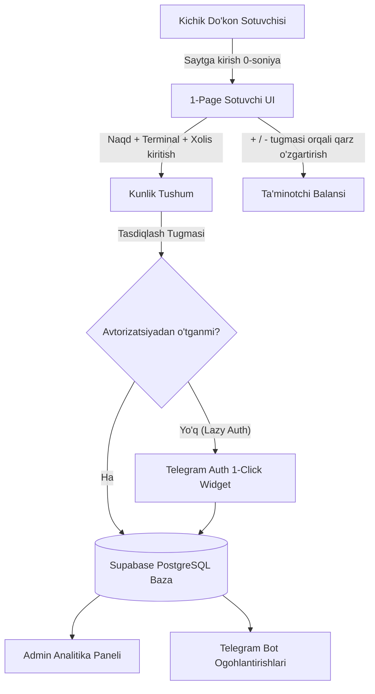
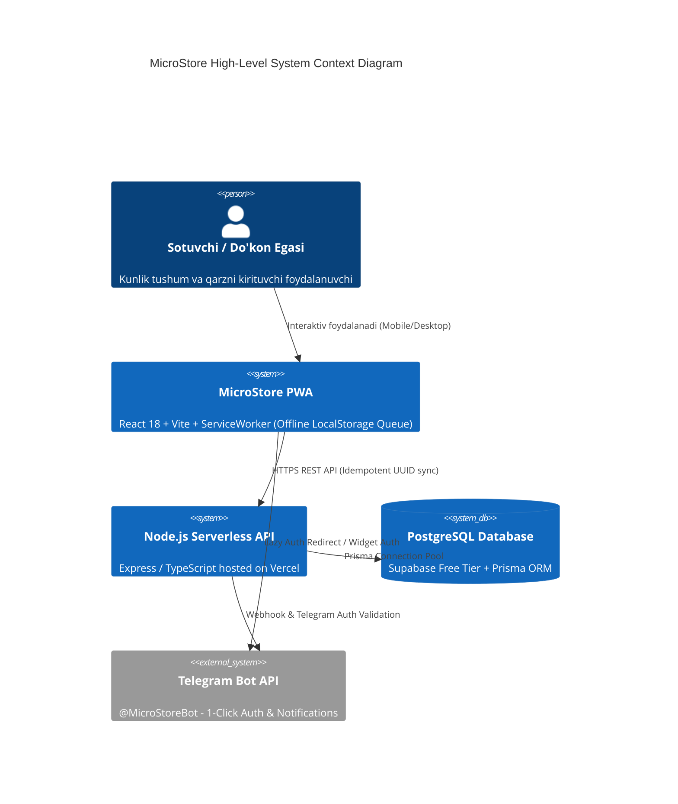

# 00. Ijroiya Xulosasi (Executive Summary)

## 1. Loyiha Haqida Umumiy Ma'lumot

**MicroStore** — kichik do'konlar, rastalar va mahalliy sotuvchilar uchun mo'ljallangan, kunlik tushum (Naqd, Terminal, Xolis) hamda ta'minotchilar (yetkazib beruvchilar) oldidagi qarzdorlik balansini soniyalar ichida yurituvchi ultra-sodda 1-sahifali Progressive Web Application (PWA) va Admin Analitika Paneli.

An'anaviy POS va ERP tizimlari (masalan, 1C, Poster POS, Jamoa) murakkab tovarlar katalogi (SKU), shtrix-kod skanerlash, narx kiritish va apparat integratsiyalarini talab qiladi. Kichik bozor va mahalliy do'kon sotuvchilarining 1000 dan ortiq tovar turlarini tizimga kiritishga vaqti ham, texnik bilimi ham yetmaydi. Oqibatda uzoq yillardan beri hisob-kitoblar qog'oz daftar-qalamda, telefon Notes ilovasida yoki Telegram saqlangan xabarlarida yuritiladi. Bu esa ma'lumotlarning yo'qolishiga, hisob-kitob xatolariga va sotuvchi hamda do'kon egasi o meida shubha-gumonlarga olib keladi.

MicroStore ushbu muammoni **"0 soniya tayyorgarlik"** (No SKU, No Inventory, No Hardware) konsepsiyasi va **3 soniyalik kiritish interfeysi** orqali to'liq raqamlashtiradi.

---

## 2. Asosiy Ko'rsatkichlar va Texnik Maqsadlar (Target Metrics)

Loyiha arxitekturasi quyidagi 6 oylik maqsadli ko'rsatkichlarga javob beradigan qilib loyihalashtirildi:

| Ko'rsatkich | Maqsadli Qiymat | Izoh / Texnik Ta'siri |
|---|---|---|
| **Faol Do'konlar (MAU)** | 150 – 200 ta faol do'kon | Har do'kon kuniga kamida 1-3 marta tizimdan foydalanadi |
| **Kunlik Tranzaksiyalar (TPD)** | 600 – 1,000 tranzaksiya/kun | Kunlik tushumlar + ta'minotchi balance o'zgarishlari |
| **Tizim Barqarorligi (Uptime)** | 99.9% availability | PWA offline-first cache va Vercel Global Edge CDN |
| **Kiritish Tezligi (UX SLA)** | ≤ 3 soniya | UI optimizatsiyasi va minimal DOM elementlari |
| **Backend API Response** | p95 ≤ 120ms | Supabase PostgreSQL va Indexlangan so'rovlar |
| **Infratuzilma Byudjeti** | **$0 / oy** (Boshlang'ich) | Vercel (Free) + Supabase (Free 500MB DB) |
| **Ishlab Chiqish Muddat (Timeline)** | 4 – 5 kun | Faza 0 (Skelet) -> Faza 1 (MVP Launch) |

---

## 3. Loyihaning Yadro Qiymati va Chegaralari (Scope & Non-Goals)

### Core Value Proposition (Yadro Qiymati)
Sotuvchi ilovani ochganidan so'ng 3 soniya ichida bugungi Naqd, Terminal va Xolis tushumini kiritib, bitta bosish bilan ta'minotchi qarzini oshirishi yoki kamaytira olishi.

### Non-Goals / Out of Scope (Ataylab Qilinmaydigan Narsalar)
- ❌ **SKU / Ombor Inventarizatsiyasi:** Tovar nomi, shtrix-kodi yoki qoldiq soni saqlanmaydi.
- ❌ **Apporat Integratsiyalari:** Chek printe, shtrix-kod skaner va POS terminal apparatlari ulanmaydi.
- ❌ **Xaridorlar Nasiyasi:** Xaridorlarga berilgan qarzlar hisobi yuritilmaydi (Faqat Ta'minotchilar).
- ❌ **Murakkab Rollar:** Kassir, omborchi, menejer ruxsatlari yo'q (Yagona Do'kon egasi/sotuvchisi seansi).
- ❌ **Pullik SMS OTP:** SMS xizmatlari ishlatilmaydi, login 100% tekin Telegram Auth orqali bajariladi.

---

## 4. Arxitektura va Texnologik Stek

MicroStore ultra-engil, tekin va offline ishlaydigan zamonaviy PWA va Serverless arxitekturasiga asoslangan.

### Texnologik Stek Xulosasi:
- **Frontend Framework:** React 18, TypeScript, Vite, Tailwind CSS.
- **Offline / PWA:** Service Worker (Workbox), LocalStorage Queue, PWA Manifest (Add to Home Screen).
- **Backend Runtime:** Node.js 20 LTS, TypeScript, Express.js (Vercel Serverless Functions).
- **Database & ORM:** PostgreSQL (Supabase Free Tier), Prisma ORM (Audit Trail & Soft Delete extensions).
- **Authentication:** Telegram WebApp / Telegram Widget Auth API (HMAC-SHA256 signature verification).
- **Notifications:** Telegram Bot API (`grammy` framework).
- **Export Engine:** `exceljs` (Excel XLSX) va `pdfmake` (Client/Server PDF generation).

---

## 5. Xavfsizlik va Audit Printsiplari

Moliyaviy ma'lumotlar shaffofligini ta'minlash va do'kon egasi hamda sotuvchi o'rtasidagi kelishmovchiliklarning oldini olish uchun bazaga **Immutable Data History (Soft Delete & Audit Trail)** standarti joriy etiladi:
1. **O'chirilmaydigan Yozuvlar:** Bazadan yozuvlar hech qachon `DELETE` qilinmaydi. O'chirish so'ralganda `is_archived = true` belgilanadi.
2. **Audit Logs:** Har bir tahrir va o'chirish harakati kim tomonidan (`user_id`), qachon (`timestamp`), va qaysi eski qiymatlar yangisiga almashtirilgani haqida `audit_logs` jadvaliga yoziladi.
3. **Idempotent Sync:** Offline kiritilgan tranzaksiyalar mijoz tomonidan yaratilgan UUID bilan yuboriladi, bu esa internet qaytganida so'rov takroran tushishining oldini oladi.

---

## 6. Ochiq Savollar (Open Questions)

1. *Supabase Free Tier cheklovlari (500MB DB) 200 ta do'kon va 1 yillik audit loglar uchun etarli bo'ladimi yoki arxivlash mexanizmini 6-oyda ishga tushirish kerakmi?*
2. *PWA offline rejimda 3 kundan ortiq qolgan qurilmada Kesh (Cache) to'lib qolishining oldini olish uchun LocalStorage hajmiga cheklov qo meilishi kerakmi?*
