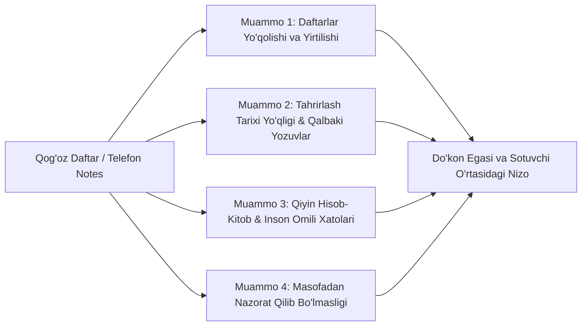
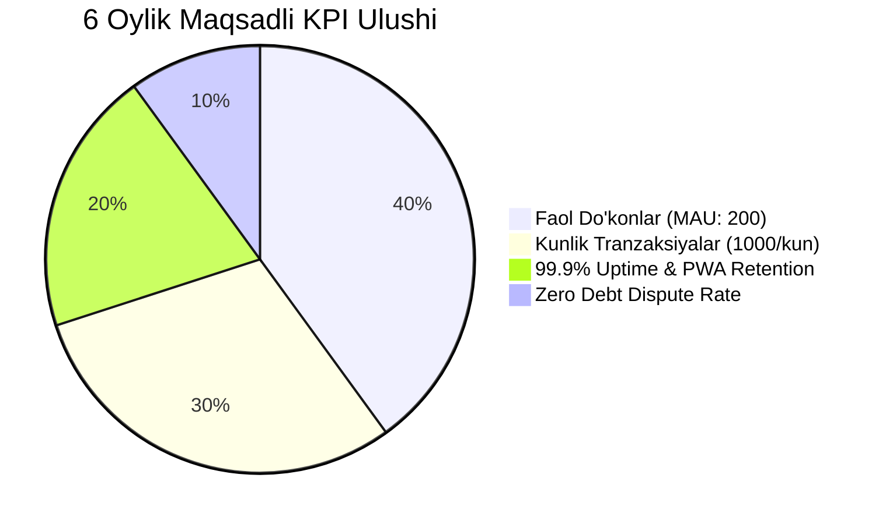

# 01. Muammo va Maqsadlar (Problem & Goals)

## 1. Muammoning Chuqur Tahlili (Problem Statement)

O'zbekistondagi va Markaziy Osiyodagi kichik oziq-ovqat do'konlari, kiyim-kechak rastalari, avto-ehtiyot qismlari va mahalliy savdo shoxobchalarining 80% dan ortig'i haligacha kunlik savdo tushumlari hamda ta'minotchilar (firma/dilerlar) oldidagi qarzlarni yuritishda **an'anaviy qog'oz daftar va qalamdan** foydalanadi.

### Bugungi usulning asosiy kamchiliklari va og'riqlari:



1. **Hisob-kitoblarning tarqoqligi va inson omili:** Kun oxirida Naqd va Terminal tushumlarini jamlashda xatoliklar yuz beradi. Ta'minotchidan tovar kelganda daftarga yozish unutiladi yoki summa noto'g'ri qo'shiladi.
2. **Hujjatlarning yo'qolishi va tahrirlash shaffofligi yo'qligi:** Daftar suvlansa, yo meib ketsa yoki yo'qolsa barcha qarzlar tarixi o'chib ketadi. Sotuvchi daftardagi raqamni o'chirib boshqa raqam yozsa, do'kon egasi buni tekshira olmaydi.
3. **Mavjud ERP / POS tizimlarining mos kelmasligi:**
   - *Poster POS, 1C, Jamoa:* Barcha tovarlar nomini (SKU), narxini, shtrix-kodini kiritishni va har bir savdoda tovar skanerlashni talab qiladi.
   - *Vaqt yetishmasligi:* 1000 xil turdagi tovar sotadigan mahalliy do'konda har bir tovar to'plamini kiritish uchun haftalab vaqt ketadi. Sotuvchining texnik savodi bitta murakkab POS interfeysini tushunishga yetmaydi.

---

## 2. Biznes Maqsadlari va Foydalanuvchi Portreti (User Persona)

### Business Goals
1. **0-Soniya Tayyorgarlik:** Do'kon egasi ilovani ochgan zoti tovar kiritmasdan, darhol hisob-kitobni boshlashi kerak.
2. **Ultra-Fast Entry (3-Soniya UX):** Kunlik Naqd, Terminal, Xolis summasi va ta'minotchi qarzini 3 soniyada kiritish imkoniyati.
3. **Shaffof Audit Trail:** Har bir o'zgarish va tahrir tarixda saqlanib, do'kon egasi va sotuvchi o meidagi ishonchni 100% ga oshirish.
4. **Offline Ishlash:** Internet uzilgan taqdirda ham ilova to'xtab qolmasligi, barcha ma'lumotlar fonda sync bo'lishi.

### User Persona (Foydalanuvchi Portreti)

```mermaid
card
    title Persona: Toshmat Aka (Kichik Do'kon Sotuvchisi)
    Age: 42 yosh
    Device: Android (Samsung A52), ba'zan Windows kompyuter
    Tech Level: O'rta (Telegram, YouTube, Instagram ishlatadi, lekin Excel/1C dan qo'rqadi)
    Goal: Kun oxirida 3 soniyada tushumni yozish, ta'minotchi kelsa "+" tugmasini bosib qarzni oshirish.
    Frustration: Murakkab formalar, parollarni eslab qolish, tovar nomlarini qidirish.
```

---

## 3. Muvaffaqiyat Metriklari (Quantitative Success Metrics)

Loyiha muvaffaqiyati 6 oylik muddat ichida quyidagi ko'rsatkichlar orqali baholanadi:



- **Faol Foydalanuvchilar (MAU):** 150 – 200 ta faol do'kon.
- **Retention Rate:** 1-haftadan keyin ilovada qolish ko'rsatkichi ≥ 75%.
- **Avg. Time to Record:** Tushum kiritish o'rtacha vaqti ≤ 3.5 soniya.
- **System Uptime:** 99.9% (Vercel + Supabase infrastructure).
- **Zero Debt Disputes:** Audit loglar tufayli qarzlar bo meicha kelishmovchiliklarni 0 ga tushirish.

---

## 4. Loyiha Chegaralari (Scope & Out of Scope)

### In-Scope (MVP Versiya - Faza 1)
- 1-Page UI Sotuvchi interfeysi (Sana selector + Naqd, Terminal, Xolis + Jami auto-calc).
- Ta'minotchilar ro'yxati va ularning balansi, `+` (qarz oshirish) va `-` (qarz uzish) tugmalari.
- Lazy Auth: Registratsiyasiz kiritish -> Submit bosganda Telegram 1-Click Auth.
- Admin Analitika Paneli (Kunlik/Haftalik/Oylik grafiklar, Excel/PDF export).
- Soft Delete & Full Audit Log (O'zgarishlar tarixi).
- PWA Offline Support (Service Worker + LocalStorage sync queue).

### Out-of-Scope (Mutlaqo Qilinmaydi)
- ❌ Tovar ombori hisobi (SKU/Inventory tracking).
- ❌ Shtrix-kod skanerlash va Chek printerlar.
- ❌ Xaridorlar nasiya hisobi.
- ❌ Ko'p darajali rollar va xodimlar ruxsatnomalari.

---

## 5. Ochiq Savollar (Open Questions)

1. *Sotuvchilar o'rtasida o'zbek tilining Kirill alifbosidan foydalanuvchilar ulushi qancha va Kirillcha UI zarurmi?*
2. *Excel export shakli mahalliy soliq hisobotlariga mos kelishi kerakmi yoki sodda moliyaviy jamlama yetarlimi?*
