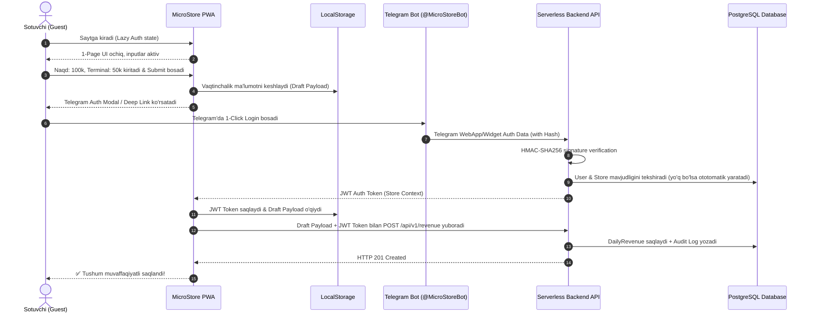

# 02. Foydalanuvchilar va Rollar (Users & Roles)

## 1. Foydalanuvchi Rollari va Seans Arxitekturasi

MicroStore minimalist falsafasiga ko'ra, bitta do'konda ko'p darajali murakkab rollar (masalan: Kassir, Omborchi, Bosh buxgalter, Administrator) va ularning mufassal huquqlari bo'lmaydi. Barcha amallar **Do'kon Seansi (Store Session)** kontekstida bajariladi.

### Tizimda mavjud 2 ta asosiy sub'ekt:

```mermaid
graph TD
    Sub1[Do'kon Egasi / Sotuvchi (Store User)] -->|Egalik qiladi| S1[Store Account]
    Sub2[Platforma Super-Admini (System Admin)] -->|Boshqaradi| S2[Global Platform]

    S1 -->|Ruxsat 1| P1[1-Page UI Sotuv kiritish]
    S1 -->|Ruxsat 2| P2[Ta'minotchilar balansini (+/-) boshqarish]
    S1 -->|Ruxsat 3| P3[Admin Analitika Paneli va Hisobotlarni yuklash]
    S1 -->|Ruxsat 4| P4[Audit Loglarni ko'rish]
```

1. **Store User (Do'kon Egasi / Sotuvchi):**
   - Do'konning barcha moliyaviy ma'lumotlariga to'liq kirish huquqiga ega.
   - Bitta do'kon seansida do'kon egasi ham, u tayinlagan sotuvchi ham bir xil Telegram akkaunt orqali yoki do'konning umumiy autentifikatsiya tokeni bilan kiradi.
2. **Platform Super-Admin (Tizim Egasi):**
   - Barcha do'konlar sonini, tranzaksiyalar hajmini va tizim holatini kuzatib boradi.
   - Yangi do'konlarni bloklash, tariflarni sozlash yoki umumiy xabarnomalar yuborish huquqiga ega.

---

## 2. Ruxsatnomalar Matritsasi (Permissions Matrix)

| Funksiya / Harakat | Store User (Do'kon Egasi/Sotuvchi) | Anonymous Guest (Chala Login) | System Super-Admin |
|---|---|---|---|
| 1-Page UI ko'rish va ma'lumot terish | ✅ Ha | ✅ Ha | ✅ Ha |
| Kunlik tushum saqlash (`CREATE`) | ✅ Ha | ❌ Yo'q (Auth So meaydi) | ✅ Ha |
| Ta'minotchi balansi o'zgartirish (`+/-`) | ✅ Ha | ❌ Yo'q (Auth So meaydi) | ✅ Ha |
| Eski tushum/qarzni tahrirlash/o'chirish | ✅ Ha (Audit Log yoziladi) | ❌ Yo'q | ✅ Ha |
| Admin Panel va Grafiklar | ✅ Ha | ❌ Yo'q | ✅ Ha (Global) |
| Excel / PDF export yuklab olish | ✅ Ha | ❌ Yo'q | ✅ Ha |
| Audit Trail tarixini ko'rish | ✅ Ha | ❌ Yo'q | ✅ Ha |
| Boshqa do'kon ma'lumotlarini ko'rish | ❌ Yo'q (Tenant Isolation) | ❌ Yo'q | ✅ Ha |

---

## 3. Lazy Auth & Onboarding Oqimi (Lazy Authentication Flow)

MicroStore loyihasida conversion (foydalanuvchi qamrovini) oshirish uchun **"Lazy Auth" (Kechiktirilgan Avtorizatsiya)** standarti qo'llaniladi. User ilovaga kirgan joyida ro'yxatdan o'tmaydi. U zudlik bilan tushum va qarz sonlarini kiritadi va faqat **"Tasdiqlash"** tugmasini bosganida autentifikatsiyadan o'tadi.



---

## 4. Telegram WebApp HMAC Auth verification Kodu

Quyidagi ishchi TypeScript kodi Telegram Auth ma'lumotlarining haqiqiyligini backend'da HMAC-SHA256 orqali tekshiradi:

```typescript
import crypto from 'crypto';

interface TelegramAuthData {
  id: number;
  first_name: string;
  username?: string;
  auth_date: number;
  hash: string;
}

export function verifyTelegramAuth(data: TelegramAuthData, botToken: string): boolean {
  const { hash, ...userData } = data;

  // 1. Data-check string hosil qilish (kalitlar bo'yicha alifbo tartibida)
  const dataCheckArr = Object.keys(userData)
    .sort()
    .map((key) => `${key}=${(userData as Record<string, any>)[key]}`);
  const dataCheckString = dataCheckArr.join('\n');

  // 2. Secret key hosil qilish: HMAC-SHA256("WebAppData", botToken)
  const secretKey = crypto
    .createHmac('sha256', 'WebAppData')
    .update(botToken)
    .digest();

  // 3. Hash hisoblash: HMAC-SHA256(secretKey, dataCheckString)
  const calculatedHash = crypto
    .createHmac('sha256', secretKey)
    .update(dataCheckString)
    .digest('hex');

  // 4. Eskirgan auth tekshiruvi (24 soatdan ko'p bo'lsa rad etiladi)
  const now = Math.floor(Date.now() / 1000);
  if (now - data.auth_date > 86400) {
    return false;
  }

  // 5. Hashlarni taqqoslash
  return calculatedHash === hash;
}
```

---

## 5. Ochiq Savollar (Open Questions)

1. *Agar bitta do'konga 2 ta turli sotuvchi 2 ta alohida Telegram akkauntdan kirishi kerak bo'lsa, "Do'konga birikish QR-kodi" yoki "Store Join PIN" mexanizmini Faza 2 ga qo'shish kerakmi?*
2. *Telegram brendi bloqlangan taqdirda muqobil PIN-kodli telefon login zaxirasini yaratish shartmi?*
