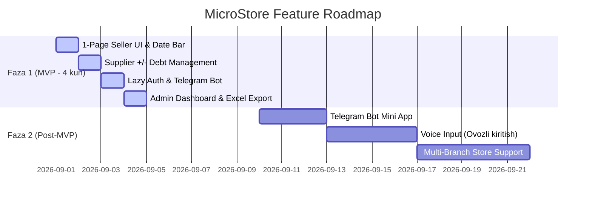

# 03. Qamrov va Funksiyalar Spetsifikatsiyasi (Scope & Features)

## 1. Funksionallikning To'liq Katalogi (Feature Matrix)

MicroStore loyihasi 2 ta asosiy interfeys moduliga bo'linadi: **A-Blok (1-Page Sotuvchi UI)** va **B-Blok (Admin Analitika Paneli)**.

```mermaid
mindmap
  root((MicroStore Ecosystem))
    A Blok: 1-Page Sotuvchi UI
      Horizontal Date Selector
        Sentabr [28] [29] [30]
        O'tmish sanalarga o'tish
      Kunlik Tushum Inputlari
        Naqd summasi
        Terminal summasi
        Xolis (boshqa/foyda)
      Jami Auto Calculator
        Dynamic Sum
      Tasdiqlash Tugmasi Checkmark
    B Blok: Ta'minotchilar Hisobi
      Ta'minotchi Ro'yxati
        Nomi va Qarzdorlik Balansi
      Amal Tugmalari
        Plus (+) Qarz oshirish
        Minus (-) Qarz kamaytirish
    Admin Analitika Paneli
      KPI Kartochkalar
        Bugungi Naqd vs Terminal
        Oylik Daromad
        Jami Ta'minotchi Qarzi
      Grafiklar
        Line / Bar Chart
        Ta'minotchilar Analizatori
      Filtr & Export
        Date Range Picker
        Excel XLSX Export
        PDF Report Generation
```

---

## 2. A-Blok: 1-Page Sotuvchi UI Funksiyalari

### 1. Sana Tanlash Bar-i (Date Selector)
- **Joylashuvi:** Sahifaning eng yuqori qismida yopishqoq (sticky) gorizontal ko'rinishda.
- **Ko'rinishi:** Joriy oy nomi va gorizontal scroll bo'ladigan kunlar tugmachalari (`[28] [29] [30] [Bugun]`).
- **Mantiq:** Default holatda bugungi sana tanlangan bo'ladi. Sotuvchi o'tmishdagi ixtiyoriy kunni tanlab, o'sha kungi tushumni ko'rishi yoki kiritishi mumkin.

### 2. Tushum Turlari Inputlari
- **Naqd (Cash):** Naqd pul ko'rinishida tushgan summa (Numpad input).
- **Terminal (Card):** Humo/Uzcard/Visa kartalari orqali tushgan summa.
- **Xolis (Other/Profit):** Qo'shimcha tushumlar, sof foyda yoki berilgan chegirmalarni kiritish maydoni.
- **JAMI (Total):** `JAMI = Naqd + Terminal + Xolis`. Bu maydon avtomatik va real-time hisoblanadi (Read-only, sotuvchi qo'lda o'zgartirmaydi).

### 3. Ta'minotchilar va Qarzlar Hisobi
- **Ro'yxat:** Har bir ta'minotchi nomi va joriy balans summasi ko'rsatiladi (masalan: `TAAM — 10.000 so'm`, `ZIYNA — 20.000 so'm`).
- **`+` (Plus Tugmasi):** Ta'minotchidan yangi tovar olinganda qarz summasini oshirish. Modal oyna ochiladi -> Summa kiritiladi -> Qarz oshadi.
- **`-` (Minus Tugmasi):** Ta'minotchiga pul berilganda qarzni kamaytirish. Modal oyna -> Summa kiritiladi -> Qarz o'chadi.

---

## 3. B-Blok: Admin Analitika Paneli

### 1. KPI Kartochkalar (Overview Metrics)
- **Bugungi Tushum:** Bugungi jami Naqd va Terminal nisbati.
- **Daromad Dinamikasi:** Haftalik va Oylik daromad jamlamasi va o'tgan haftaga nisbatan o'sish %.
- **Jami Qarzdorlik:** Barcha ta'minotchilar oldidagi umumiy qarzlar yig'indisi.

### 2. Grafik va Analitikalar
- **Sotuvlar Grafigi:** Kunlar va haftalar bo'yicha Naqd (Yashil) va Terminal (Ko'k) tushumlarining nisbatini ko meatuvchi Stacked Bar Chart yoki Line Chart.
- **Ta'minotchilar Analizatori:** Qaysi ta'minotchidan eng ko'p tovar olinayotgani va eng ko'p qarz qaysi birida ekanligini ko'rsatuvchi top-5 reyting.

### 3. Export va Hisobotlar Engine
- **Date Range Filter:** Bugun, Shu hafta, Shu oy, Chorak, Yil yoki Custom Date Picker.
- **Excel Export:** `MicroStore_Hisobot_2026-08.xlsx` faylini shakllantirish (Barcha kunlik tushumlar va ta'minotchilar balansi alohida varoqlarda).
- **PDF Export:** Rasmiy muhr/imzo joyi bor chop etishga tayyor `PDF` formatdagi ta'minotchilar akt-sverka hujjati.

---

## 4. MVP (Faza 1) vs Faza 2 Funksiyalar Taqsimoti



| Funksiya | Faza 1 (MVP) | Faza 2 (Post-MVP) | Izoh |
|---|---|---|---|
| 1-Page Sotuvchi UI | ✅ Kiritilgan | - | Yadro funksiya |
| Ta'minotchilar Balansi (+/-) | ✅ Kiritilgan | - | Yadro funksiya |
| Lazy Telegram Auth | ✅ Kiritilgan | - | 0$ Login flow |
| Soft Delete & Audit Trail | ✅ Kiritilgan | - | Xavfsizlik standarti |
| Admin Dashboard (KPI, Charts) | ✅ Kiritilgan | - | Analitika |
| Excel & PDF Export | ✅ Kiritilgan | - | Reporting |
| Telegram Bot Notification | ✅ Kiritilgan | - | Kunlik eslatmalar |
| Voice-to-Text Entry (Ovozli) | ❌ Qilinmaydi | 🔮 Faza 2 | Web Speech API orqali ovoz bilan kiritish |
| Multi-Branch (Ko'p filiallar) | ❌ Qilinmaydi | 🔮 Faza 2 | Bitta zontik ostida 5 ta do'kon yuritish |

---

## 5. Ochiq Savollar (Open Questions)

1. *Xolis inputi manfiy (foyda o'rniga ziyon/chegirma) summalarni ham qabul qilishi kerakmi?*
2. *Excel export hisobotida o'chirilgan (Soft deleted) yozuvlar ham "Arxiv" ustunida ko'rinishi kerakmi?*
