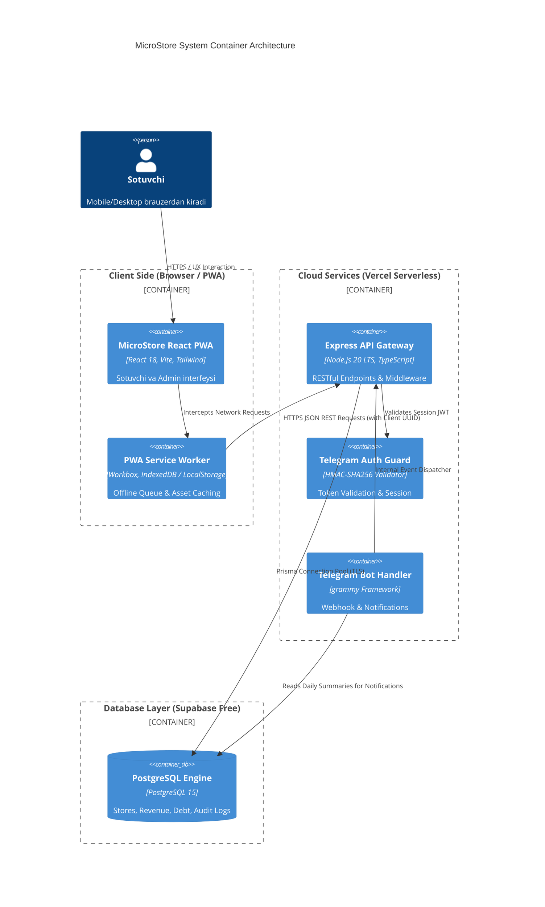
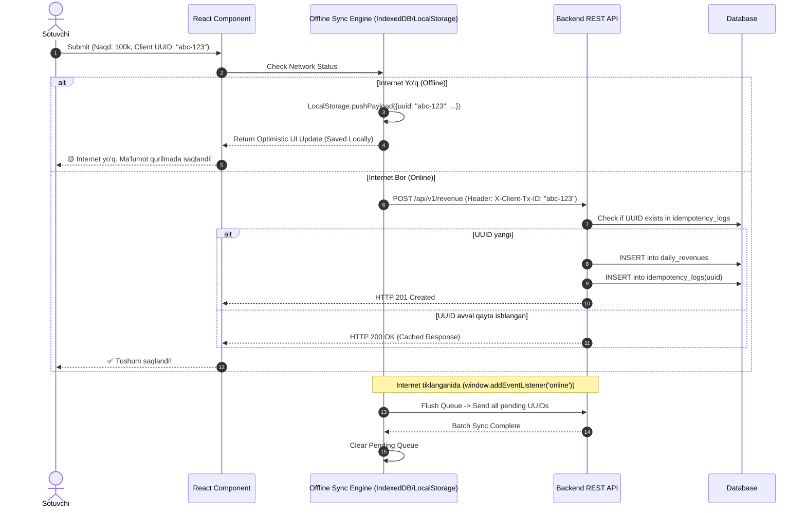

# 04. Tizim Arxitekturasi (System Architecture)

## 1. Umumiy Tizim Diagrammasi (C4 Container Diagram)

MicroStore arxitekturasi Client-Side Rendering (CSR) PWA Frontend, Vercel Serverless Node.js API Gateway, Supabase PostgreSQL ma'lumotlar bazasi hamda Telegram Bot API servisidan tashkil topgan.



---

## 2. Monolit vs Serverless Arxitektura Tanlovi (Justification)

| Mezon | An'anaviy Monolit Server (Docker/VPS) | Serverless Architecture (Vercel + Supabase) | Tanlangan Yechim |
|---|---|---|---|
| **Oylik Xarajat** | $5 – $10/oy (VPS rent) | **$0 / oy** (Vercel & Supabase Free Tier) | **Serverless (Yutdi)** |
| **DevOps Murakkabligi** | Nginx, SSL, Docker Compose sozlash | Zero Config Deployment (Git Push to Deploy) | **Serverless (Yutdi)** |
| **Scaling (Masshtablanish)** | Qo'lda RAM/CPU oshirish kerak | Avtomatik elastic scaling | **Serverless (Yutdi)** |
| **Cold Start Xavfi** | Cold start yo'q | 250ms – 1s cold start (Cron Ping bilan yechiladi) | **Serverless (Qabul qilindi)** |

**Qaror:** MicroStore 4-5 kunlik tezkor deadline va $0 oylik infratuzilma byudjeti talabidan kelib chiqib **Vercel Serverless Functions + Supabase PostgreSQL** arxitekturasini tanladi.

---

## 3. Loyiha Papka Strukturasi (Folder Structure & Modular Monorepo)

```text
MicroStore/
├── docs/                        # Arxitektura hujjatlari
│   └── architecture/
├── apps/
│   ├── web/                     # React PWA Frontend Application
│   │   ├── public/
│   │   │   ├── manifest.json    # PWA Manifest
│   │   │   └── sw.js            # Custom Service Worker
│   │   ├── src/
│   │   │   ├── components/      # UI komponentlar (DateSelector, InputCard, DebtList)
│   │   │   ├── pages/           # Pages (SellerPage, DashboardPage)
│   │   │   ├── hooks/           # Custom React Hooks (useOfflineSync, useRevenue)
│   │   │   ├── services/        # API Client Services (axios/fetch wrapper)
│   │   │   ├── store/           # Client State (Zustand state store)
│   │   │   └── utils/           # Helper functions (currency formatter)
│   │   └── package.json
│   │
│   └── api/                     # Backend API & Telegram Bot
│       ├── api/                 # Vercel Serverless Route Handler
│       │   └── index.ts
│       ├── src/
│       │   ├── controllers/     # Revenue, Supplier, Analytics controllers
│       │   ├── middleware/      # AuthGuard, RateLimiter, ErrorHandler
│       │   ├── services/        # Business Logic Services
│       │   ├── bot/             # Telegram Bot Logic (grammy)
│       │   └── db/              # Prisma Client Setup
│       └── package.json
│
├── packages/
│   └── database/                # Prisma DB Schema & Migrations
│       ├── prisma/
│       │   └── schema.prisma
│       └── src/
├── package.json                 # Monorepo root (npm / pnpm workspaces)
└── tsconfig.json
```

---

## 4. Offline Queue Sync Pattern & Implementation

Offline rejimda ishlovchi sotuvchi internet uzilganda ma'lumot kiritganda, so'rov darhol `LocalStorage`dagi navbatga (Queue) tushadi. Internet tiklanishi bilan fonda **Idempotent Background Sync** amalga oshiriladi.



### TypeScript Offline Queue Hook Namunasi:

```typescript
import { useState, useEffect } from 'react';
import { v4 as uuidv4 } from 'uuid';

export interface PendingTransaction {
  id: string; // Client UUID
  date: string;
  cashAmount: number;
  terminalAmount: number;
  xolisAmount: number;
  timestamp: number;
}

export function useOfflineSync() {
  const [pendingQueue, setPendingQueue] = useState<PendingTransaction[]>([]);

  useEffect(() => {
    // 1. LocalStorage-dan navbatni o'qish
    const savedQueue = localStorage.getItem('microstore_pending_queue');
    if (savedQueue) {
      setPendingQueue(JSON.parse(savedQueue));
    }

    // 2. Internet yonganida avtomatik sync qilish
    const handleOnline = async () => {
      await flushQueue();
    };

    window.addEventListener('online', handleOnline);
    return () => window.removeEventListener('online', handleOnline);
  }, []);

  const saveOfflineTransaction = (tx: Omit<PendingTransaction, 'id' | 'timestamp'>) => {
    const newTx: PendingTransaction = {
      ...tx,
      id: uuidv4(), // Idempotent Client UUID
      timestamp: Date.now(),
    };

    const updatedQueue = [...pendingQueue, newTx];
    setPendingQueue(updatedQueue);
    localStorage.setItem('microstore_pending_queue', JSON.stringify(updatedQueue));
  };

  const flushQueue = async () => {
    const queue = JSON.parse(localStorage.getItem('microstore_pending_queue') || '[]');
    if (queue.length === 0) return;

    for (const item of queue) {
      try {
        await fetch('/api/v1/revenue/sync', {
          method: 'POST',
          headers: {
            'Content-Type': 'application/json',
            'X-Client-Tx-ID': item.id,
          },
          body: JSON.stringify(item),
        });
      } catch (err) {
        console.error('Sync error for item:', item.id, err);
        return; // Keyingi galgacha to'xtaydi
      }
    }

    // Muvaffaqiyatli o'tgach tozalaymiz
    localStorage.setItem('microstore_pending_queue', JSON.stringify([]));
    setPendingQueue([]);
  };

  return { saveOfflineTransaction, pendingCount: pendingQueue.length, flushQueue };
}
```

---

## 5. Ochiq Savollar (Open Questions)

1. *Prisma Connection Pooling Serverless muhitda (Vercel Functions) max DB connection limitiga urilmasligi uchun Supabase Connection Bouncer (PgBouncer) yoqilgani ma'qulmi?*
2. *Localstorage o'rniga brauzerning IndexedDB xotirasidan foydalanish 4-kunlik deadlineda murakkablik tug'dirmaydimi?*
