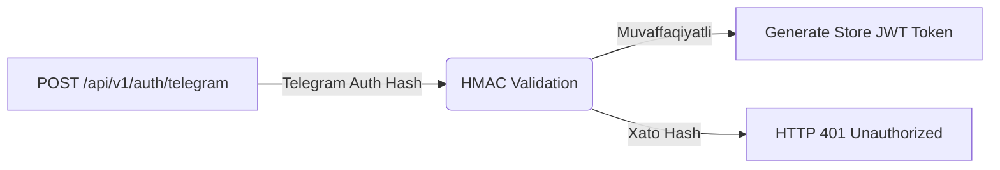

# 06. API Dizayni va Standartlari (API Design & Specifications)

## 1. RESTful API Tamoyillari va Versiyalash

MicroStore backend API arxitekturasi **RESTful** tamoyillariga va **JSON:API** formatiga mos ravishda loyihalashtirildi. Barcha API marshrutlari `/api/v1/` prefiksi bilan versiyalanadi.

### Asosiy Standartlar:
- **Base URL:** `https://microstore.uz/api/v1`
- **Content-Type:** `application/json; charset=utf-8`
- **Autentifikatsiya:** `Authorization: Bearer <JWT_STORE_TOKEN>`
- **Idempotentlik:** Offline so'rovlar uchun `X-Client-Tx-ID: <UUID>` sarlavhasi.

---

## 2. API Endpoints Ro'yxati (Catalog of Endpoints)

### A. Autentifikatsiya (Authentication Module)



#### 1. `POST /api/v1/auth/telegram`
- **Tavsif:** Telegram WebApp / Widget Auth hashini tekshiradi va Store JWT oladi.
- **Request Body:**
```json
{
  "id": 123456789,
  "first_name": "Toshmat",
  "username": "toshmat_dev",
  "auth_date": 1756468800,
  "hash": "c5f949c256d0284e3a479e0a030dbb..."
}
```
- **Response HTTP 200 OK:**
```json
{
  "success": true,
  "token": "eyJhbGciOiJIUzI1NiIsInR5cCI6IkpXVCJ9...",
  "store": {
    "id": "9b1deb4d-3b7d-4bad-9bdd-2b0d7b3dcb6d",
    "name": "Toshmat Aka Do'koni"
  }
}
```

---

### B. Kunlik Tushumlar (Daily Revenue Module)

#### 2. `GET /api/v1/revenues`
- **Tavsif:** Tanlangan oydagi yoki sana oralig'idagi kunlik tushumlar ro'yxatini oladi.
- **Query Params:** `?month=2026-08` yoki `?from=2026-08-01&to=2026-08-31`
- **Response HTTP 200 OK:**
```json
{
  "success": true,
  "data": [
    {
      "id": "a1b2c3d4-e5f6-7a8b-9c0d-1e2f3a4b5c6d",
      "entryDate": "2026-08-29",
      "cashAmount": 150000.00,
      "terminalAmount": 80000.00,
      "xolisAmount": 10000.00,
      "totalAmount": 240000.00,
      "updatedAt": "2026-08-29T16:20:00Z"
    }
  ]
}
```

#### 3. `POST /api/v1/revenues` (Upsert Daily Revenue)
- **Header:** `X-Client-Tx-ID: 7f3c1d42-8e9a-4b0c-a1d2-3e4f5a6b7c8d`
- **Request Body:**
```json
{
  "entryDate": "2026-08-29",
  "cashAmount": 150000,
  "terminalAmount": 80000,
  "xolisAmount": 10000
}
```
- **Response HTTP 201 Created:**
```json
{
  "success": true,
  "message": "Tushum saqlandi",
  "data": {
    "id": "a1b2c3d4-e5f6-7a8b-9c0d-1e2f3a4b5c6d",
    "entryDate": "2026-08-29",
    "totalAmount": 240000.00
  }
}
```

---

### C. Ta'minotchilar va Qarzlar (Supplier Debt Module)

#### 4. `GET /api/v1/suppliers`
- **Tavsif:** Do'konning barcha aktiv ta'minotchilari va ularning qarz balansi ro'yxati.
- **Response HTTP 200 OK:**
```json
{
  "success": true,
  "data": [
    {
      "id": "e4f3d2c1-b0a9-8f7e-6d5c-4b3a2f1e0d9c",
      "name": "TAAM (Sut Mahsulotlari)",
      "currentBalance": 10000.00,
      "createdAt": "2026-08-01T10:00:00Z"
    },
    {
      "id": "c1b2a3d4-e5f6-7a8b-9c0d-1e2f3a4b5c6d",
      "name": "ZIYNA (Ichimliklar)",
      "currentBalance": 20000.00,
      "createdAt": "2026-08-05T12:00:00Z"
    }
  ]
}
```

#### 5. `POST /api/v1/suppliers/:id/transaction` (Qarz +/-)
- **Header:** `X-Client-Tx-ID: 11223344-5566-7788-9900-aabbccddeeff`
- **Request Body:**
```json
{
  "type": "INCREASE_DEBT", // (+) qarz oshdi yoki "DECREASE_DEBT" (-) pul berildi
  "amount": 50000,
  "note": "Yangi sharbat tovarlari keldi"
}
```
- **Response HTTP 200 OK:**
```json
{
  "success": true,
  "message": "Ta'minotchi balansi yangilandi",
  "newBalance": 70000.00
}
```

---

## 3. Standart Xato Formati (Standard Error Payload)

Barcha backend xatoliklari yagona strukturadagi JSON obyektini qaytaradi:

```json
{
  "success": false,
  "error": {
    "code": "INVALID_INPUT_AMOUNT",
    "message": "Tushum summasi manfiy bo'lishi mumkin emas",
    "details": [
      {
        "field": "cashAmount",
        "issue": "Must be greater than or equal to 0"
      }
    ],
    "timestamp": "2026-08-29T16:21:00Z"
  }
}
```

### Ko'p Uchraydigan HTTP Status Kodlari:
- `400 Bad Request` — Yaroqsiz input ma'lumotlar (Zod Validation error).
- `401 Unauthorized` — JWT Token mavjud emas yoki muddati o'tgan.
- `409 Conflict` — Shu sanadagi tushum allaqachon mavjud va arxivlangan.
- `429 Too Many Requests` — Rate limit oshib ketdi (DDoS himoyasi).

---

## 4. Production Express Controller Kodu

Quyidagi kod **Zod Validation** va **Prisma Transaction** ishlatilgan ishchi Revenue Controller funksiyasidir:

```typescript
import { Request, Response, NextFunction } from 'express';
import { z } from 'zod';
import { prisma } from '../db/client';

// Zod Validation Schema
const createRevenueSchema = z.object({
  entryDate: z.string().regex(/^\d{4}-\d{2}-\d{2}$/, "Sana YYYY-MM-DD formatida bo'lishi kerak"),
  cashAmount: z.number().min(0, "Naqd pul 0 dan kichik bo'lmaydi"),
  terminalAmount: z.number().min(0, "Terminal summasi 0 dan kichik bo'lmaydi"),
  xolisAmount: z.number().default(0),
});

export async function upsertRevenueController(req: Request, res: Response, next: NextFunction) {
  try {
    const storeId = req.storeId; // AuthMiddleware tomonidan qo'yiladi
    const userId = req.userId;
    const clientTxId = req.headers['x-client-tx-id'] as string;

    // 1. Validation
    const validatedData = createRevenueSchema.parse(req.body);
    const entryDate = new Date(validatedData.entryDate);
    const totalAmount = validatedData.cashAmount + validatedData.terminalAmount + validatedData.xolisAmount;

    // 2. Prisma Database Transaction (Audit Log & Upsert)
    const result = await prisma.$transaction(async (tx) => {
      // Eskisini ko'rish
      const existing = await tx.dailyRevenue.findUnique({
        where: { storeId_entryDate: { storeId, entryDate } }
      });

      // Upsert yozuvi
      const revenue = await tx.dailyRevenue.upsert({
        where: { storeId_entryDate: { storeId, entryDate } },
        create: {
          storeId,
          entryDate,
          cashAmount: validatedData.cashAmount,
          terminalAmount: validatedData.terminalAmount,
          xolisAmount: validatedData.xolisAmount,
          totalAmount,
          clientTxId,
        },
        update: {
          cashAmount: validatedData.cashAmount,
          terminalAmount: validatedData.terminalAmount,
          xolisAmount: validatedData.xolisAmount,
          totalAmount,
          updatedAt: new Date(),
        }
      });

      // Audit Log yozish
      await tx.auditLog.create({
        data: {
          storeId,
          userId,
          entityName: 'DAILY_REVENUE',
          entityId: revenue.id,
          action: existing ? 'UPDATE' : 'CREATE',
          oldValues: existing ? JSON.parse(JSON.stringify(existing)) : null,
          newValues: JSON.parse(JSON.stringify(revenue)),
        }
      });

      return revenue;
    });

    return res.status(201).json({
      success: true,
      message: "Tushum muvaffaqiyatli saqlandi",
      data: result
    });
  } catch (error) {
    next(error);
  }
}
```

---

## 5. Ochiq Savollar (Open Questions)

1. *Rate Limiting chegarasini har bir IP manzil uchun minutiga 60 so'rov qilib belgilash PWA background sync jarayonida yetarli bo'ladimi?*
2. *Excel export fayllarini generatsiya qilish so'rovini HTTP REST o'rniga Serverless Streaming API orqali uzatish kerakmi?*
