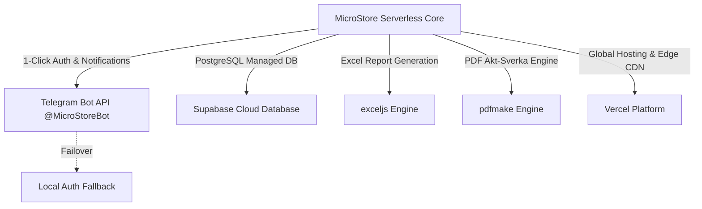

# 07. Integratsiyalar (External System Integrations)

## 1. Integratsiyalar Xaritasi (System Integration Map)

MicroStore loyihasi minimal arxitektura tamoyillariga va **$0 operatsion xarajat** talabiga bo'ysungan holda faqat zaruriy va tekin tashqi sistemalar bilan integratsiya qilinadi.



---

## 2. Telegram Bot API Integratsiyasi (`grammy` Framework)

Telegram Bot MicroStore tizimida **2 ta asosiy vazifani** bajaradi:
1. **Autentifikatsiya Gateway (Telegram Login):** Sotuvchini 1-bosishda avtorizatsiyadan o'tkazish.
2. **Bildirishnomalar va Eslatmalar:** Har kuni kechki soat 20:00 da tushum kiritishni eslatish va har hafta yakunida oylik/haftalik jamlama hisobotni yuborish.

### Telegram Webhook vs Polling:
Production muhitida Telegram Bot **Webhook** rejimida ishlaydi (`POST /api/v1/bot/webhook`). Bu esa VPS xarajatini tejanglab, Vercel Serverless Function ichida tekin ishlash imkonini beradi.

```typescript
import { Bot, webhookCallback } from 'grammy';
import { prisma } from './db/client';

const bot = new Bot(process.env.TELEGRAM_BOT_TOKEN || '');

// /start komandasi ishlovi
bot.command('start', async (ctx) => {
  const telegramId = ctx.from?.id;
  const firstName = ctx.from?.first_name || 'Sotuvchi';

  ctx.reply(
    `Salom ${firstName}! 📱 MicroStore tizimiga xush kelibsiz.\n\n` +
    `Kunlik tushum va ta'minotchilar qarzini yuritish uchun quyidagi tugmani bosing:`,
    {
      reply_markup: {
        inline_keyboard: [
          [
            {
              text: '🚀 MicroStore Ilovasini Ochish',
              web_app: { url: process.env.FRONTEND_URL || 'https://microstore.uz' }
            }
          ]
        ]
      }
    }
  );
});

// Daily Reminder Cron Job Handler
export async function sendDailyReminders() {
  const storesWithoutEntryToday = await prisma.store.findMany({
    where: {
      dailyRevenues: {
        none: {
          entryDate: new Date(new Date().toISOString().split('T')[0])
        }
      }
    },
    include: { users: true }
  });

  for (const store of storesWithoutEntryToday) {
    for (const user of store.users) {
      try {
        await bot.api.sendMessage(
          Number(user.telegramId),
          `⚠️ **Eslatma!** Bugungi kunlik tushum hali kiritilmadi.\n` +
          `Daftarga yozishni unuting, 3 soniyada ilovaga kiriting!`,
          { parse_mode: 'Markdown' }
        );
      } catch (err) {
        console.error(`Telegram message error to user ${user.telegramId}:`, err);
      }
    }
  }
}

export const handleTelegramWebhook = webhookCallback(bot, 'express');
```

---

## 3. Excel (XLSX) Export Engine (`exceljs`)

Admin paneldan va Telegram Bot orqali yuklab olinadigan Excel hisoboti 2 ta varoqdan (Worksheet) iborat bo'ladi:
1. **"Kunlik Tushumlar" Varaqi:** Sanalar, Naqd, Terminal, Xolis va Jami summalari.
2. **"Ta'minotchilar Balansi" Varaqi:** Ta'minotchi nomi, joriy qarz summasi va oxirgi o'zgarish sanasi.

```typescript
import ExcelJS from 'exceljs';

export async function generateExcelReport(storeName: string, revenues: any[], suppliers: any[]): Promise<Buffer> {
  const workbook = new ExcelJS.Workbook();
  workbook.creator = 'MicroStore System';
  workbook.created = new Date();

  // 1. Kunlik Tushumlar Varoqi
  const revSheet = workbook.addWorksheet('Kunlik Tushumlar');
  revSheet.columns = [
    { header: 'Sana', key: 'date', width: 15 },
    { header: 'Naqd Pul (so\'m)', key: 'cash', width: 20 },
    { header: 'Terminal (so\'m)', key: 'terminal', width: 20 },
    { header: 'Xolis (so\'m)', key: 'xolis', width: 18 },
    { header: 'JAMI TUSHUM', key: 'total', width: 22 },
  ];

  revenues.forEach((r) => {
    revSheet.addRow({
      date: r.entryDate.toISOString().split('T')[0],
      cash: Number(r.cashAmount),
      terminal: Number(r.terminalAmount),
      xolis: Number(r.xolisAmount),
      total: Number(r.totalAmount),
    });
  });

  // 2. Ta'minotchilar Varoqi
  const supSheet = workbook.addWorksheet('Ta\'minotchilar Balansi');
  supSheet.columns = [
    { header: 'Ta\'minotchi Nomi', key: 'name', width: 30 },
    { header: 'Qarzdorlik Summasi (so\'m)', key: 'balance', width: 25 },
  ];

  suppliers.forEach((s) => {
    supSheet.addRow({
      name: s.name,
      balance: Number(s.currentBalance),
    });
  });

  const buffer = await workbook.xlsx.writeBuffer();
  return buffer as Buffer;
}
```

---

## 4. Tizim Chidamliligi va Ulanish Yiqilishi (Resilience & Circuit Breaker)

```mermaid
graph TD
    A[API Request] --> B{Telegram API Ishlayaptimi?}
    B -- Ha --> C[Yuborish & Telegram Logs]
    B -- Yo'q / Timeout --> D[Circuit Breaker Active]
    D --> E[Fallback: Log Error & Return HTTP 200 to User]
    E --> F[Retry Queue background task]
  ```

Agar Telegram API uzilib qolsa yoki bloklansa:
1. **User UX to'xtamaydi:** Sotuvchining tushum kiritishi Telegram xabarnomasi yuborilishi yiqilgan taqdirda ham HTTP 200 muvaffaqiyatli qaytaraveradi (Asenkron task).
2. **Offline Fallback:** Notificationlar xatolar navbatiga (`error_retry_queue`) tushadi va 15 daqiqadan keyin qayta yuboriladi.

---

## 5. Ochiq Savollar (Open Questions)

1. *Telegram O'zbekistonda sekinlashgan hollarda tushum kiritishni to'xtatib qo'ymaslik uchun Telegram API chaqiruvlari to'liq asinxron (fire-and-forget) rejimiga o'tkazilsinmi?*
2. *PDF hisobotlarga do'kon logotipi va shtamp rasmini qo'shish imkoniyatini yaratish kerakmi?*
