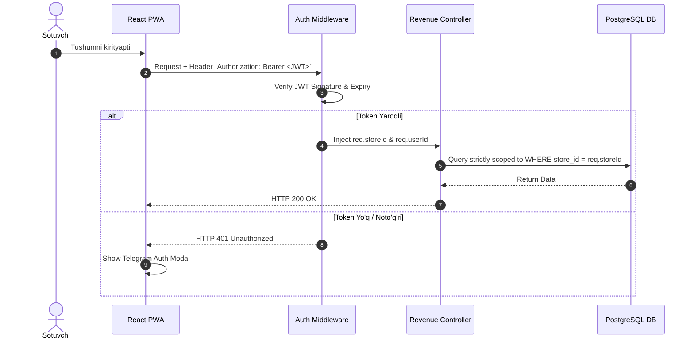

# 08. Autentifikatsiya va Ruxsatlar (Auth & Permissions)

## 1. Auth Arxitekturasi va Token Menejmenti

MicroStore loyihasi SMS xizmatlari uchun ortiqcha pul sarflamaslik va sotuvchiga 1 soniyali oson kirish tajribasini berish uchun **Telegram WebApp / Telegram Widget OAuth** autentifikatsiya standartidan foydalanadi.

### Security Token Specification:
- **Token Turi:** JSON Web Token (JWT)
- **Sign Algoritmi:** `HS256` (HMAC with SHA-256)
- **Token Muddati (TTL):** 90 kun (Sotuvchilar har kuni qayta login bo'lmasligi uchun uzoq muddatli qilib belgilanadi).
- **Storage:** Client-side `LocalStorage` (PWA muhiti).



---

## 2. JWT Token Payload Strukturasi

JWT token yaratilganda uning ichiga faqat zaruriy va yengil ma'lumotlar joylanadi:

```json
{
  "sub": "user_uuid_11223344-5566-7788-9900-aabbccddeeff",
  "storeId": "store_uuid_9b1deb4d-3b7d-4bad-9bdd-2b0d7b3dcb6d",
  "telegramId": 123456789,
  "role": "STORE_USER",
  "iat": 1756468800,
  "exp": 1764244800
}
```

---

## 3. Tenant Data Isolation Middleware (Ko'p Ijarachilik Xavfsizligi)

MicroStore platformasida barcha do'konlar ma'lumotlari bitta PostgreSQL bazasida saqlanadi (Single Database Multi-Tenancy). Shuning uchun bir do'kon sotuvchisi boshqa do'kon ma'lumotlarini aslo ko'ra olmasligi uchun **Row-Level Tenant Isolation Middleware** yo'lga qo'yiladi.

### Production Auth Middleware Kodu:

```typescript
import { Request, Response, NextFunction } from 'express';
import jwt from 'jsonwebtoken';

// Express Request interfeysini kengaytirish
declare global {
  namespace Express {
    interface Request {
      storeId?: string;
      userId?: string;
      telegramId?: number;
    }
  }
}

interface JWTPayload {
  sub: string;
  storeId: string;
  telegramId: number;
  role: string;
}

export function authGuardMiddleware(req: Request, res: Response, next: NextFunction) {
  const authHeader = req.headers.authorization;

  if (!authHeader || !authHeader.startsWith('Bearer ')) {
    return res.status(401).json({
      success: false,
      error: {
        code: 'UNAUTHORIZED',
        message: 'Autentifikatsiya tokeni topilmadi',
      }
    });
  }

  const token = authHeader.split(' ')[1];

  try {
    const secret = process.env.JWT_SECRET || 'fallback_super_secret_key_123';
    const decoded = jwt.verify(token, secret) as JWTPayload;

    // Tenant Context-ni so'rovga biriktirish
    req.userId = decoded.sub;
    req.storeId = decoded.storeId;
    req.telegramId = decoded.telegramId;

    next();
  } catch (err) {
    return res.status(401).json({
      success: false,
      error: {
        code: 'INVALID_TOKEN',
        message: 'Token yaroqsiz yoki muddati o\'tgan',
      }
    });
  }
}
```

---

## 4. Xavfsizlik Chorasi: CSRF va Replay Attack Himoyasi

1. **Telegram Hash Replay Attack Himoyasi:** Telegram'dan kelgan `auth_date` 24 soatdan (86400 soniya) eski bo'lsa, avtorizatsiya rad etiladi.
2. **Rate Limiting on Auth:** IP manzil va Telegram ID bo'yicha minutiga maksimal 5 marta auth so'rovi yuborishga ruxsat beriladi (`express-rate-limit`).

---

## 5. Ochiq Savollar (Open Questions)

1. *Agar sotuvchi telefonini yo meotib qo'ysa, Do'kon egasi o'sha seansni bekor qilishi (Token Revocation / Blacklist) uchun Redis kabi in-memory kesh joylash kerakmi?*
2. *JWT token muddati 90 kun bo'lishi xavfsizlik va UX balansi uchun yetarlimi?*
