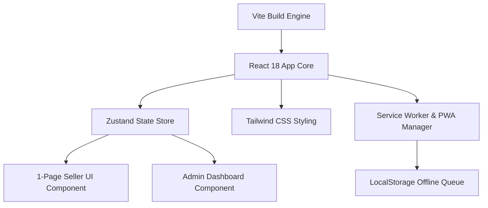

# 09. Frontend Arxitekturasi va UI/UX (Frontend Architecture)

## 1. Texnologik Stek va UI/UX Tamoyillari

MicroStore frontend qismi minimalist, tezkor va **"Ultra-Sodda 1-Page UI"** konsepsiyasiga asosan qurilgan.

### Frontend Stek:
- **Framework:** React 18, TypeScript, Vite.
- **Styling:** Tailwind CSS (Dark/Light mode support, HSL tailored color palette).
- **State Management:** Zustand (Yengil va reaktiv global state).
- **PWA Module:** Custom Service Worker + Workbox (Offline Caching).
- **Charts Engine:** Chart.js / Recharts (Responsive Admin analytics).



---

## 2. Component Hiyerarxiyasi va Sahifalar Strukturasi

```text
apps/web/src/
├── components/
│   ├── seller/
│   │   ├── DateSelector.tsx        # Horizontal sticky date picker
│   │   ├── RevenueInputs.tsx       # Naqd, Terminal, Xolis inputs
│   │   ├── TotalBar.tsx            # Auto calculated JAMI bar
│   │   └── SupplierList.tsx        # Supplier cards with (+) and (-) buttons
│   ├── admin/
│   │   ├── KPICards.tsx            # Revenue overview cards
│   │   ├── SalesChart.tsx          # Bar/Line chart for cash vs terminal
│   │   └── SupplierAnalyzer.tsx   # Top suppliers analysis
│   └── common/
│       ├── Button.tsx              # Touch-friendly large buttons
│       └── Modal.tsx               # Plus/Minus debt modal dialogs
├── pages/
│   ├── SellerPage.tsx              # Main 1-Page UI
│   └── DashboardPage.tsx           # Admin Analytics Dashboard
└── store/
    └── useStore.ts                 # Zustand store logic
```

---

## 3. A-Blok 1-Page UI Interfeysi (Wireframe Architecture)

```text
+-------------------------------------------------------------+
|  [Sentabr]   [27]   [28]   [*29* (Bugun)]   [30]            | <- Sticky Date Selector
+-------------------------------------------------------------+
|                                                             |
|  💵 Naqd Pul (Cash):                                        |
|  [ 150 000                                 ] UZS            |
|                                                             |
|  💳 Terminal (Card):                                        |
|  [ 80 000                                  ] UZS            |
|                                                             |
|  ✨ Xolis (Profit/Other):                                   |
|  [ 10 000                                  ] UZS            |
|                                                             |
| ----------------------------------------------------------- |
|  📊 JAMI TUSHUM:  240 000 UZS                            | <- Auto Calculated
|                                                             |
|  [ ✅ TASDIQLASH VA SAQLASH (Submit)                      ] | <- Big Touch Button
|                                                             |
+-------------------------------------------------------------+
|  🔶 TA'MINOTCHILAR (QARZLAR BALANSI)                        |
|                                                             |
|  • TAAM (Sut)         Balans: 10.000 so'm    [ + ]  [ - ]    |
|  • ZIYNA (Ichimlik)   Balans: 20.000 so'm    [ + ]  [ - ]    |
|                                                             |
|  [ + YANGI TA'MINOTCHI QO'SHISH                           ] |
+-------------------------------------------------------------+
```

---

## 4. Production React Component Kodu (`SellerPage.tsx`)

Quyida 1-Page Sotuvchi UI uchun real reaktiv React kodi keltirilgan:

```tsx
import React, { useState, useMemo } from 'react';
import { useOfflineSync } from '../hooks/useOfflineSync';

export const SellerPage: React.FC = () => {
  const [selectedDate, setSelectedDate] = useState<string>(
    new Date().toISOString().split('T')[0]
  );
  const [cash, setCash] = useState<string>('');
  const [terminal, setTerminal] = useState<string>('');
  const [xolis, setXolis] = useState<string>('');
  const [isSubmitting, setIsSubmitting] = useState(false);

  const { saveOfflineTransaction } = useOfflineSync();

  // Auto calculated Total sum
  const totalSum = useMemo(() => {
    const c = parseFloat(cash) || 0;
    const t = parseFloat(terminal) || 0;
    const x = parseFloat(xolis) || 0;
    return c + t + x;
  }, [cash, terminal, xolis]);

  const handleSubmit = async (e: React.FormEvent) => {
    e.preventDefault();
    if (totalSum === 0) {
      alert("Iltimos, kamida bitta tushum summasini kiriting!");
      return;
    }

    setIsSubmitting(true);
    try {
      // Local/Offline First Save
      saveOfflineTransaction({
        date: selectedDate,
        cashAmount: parseFloat(cash) || 0,
        terminalAmount: parseFloat(terminal) || 0,
        xolisAmount: parseFloat(xolis) || 0,
      });

      alert("✅ Tushum muvaffaqiyatli saqlandi!");
      setCash('');
      setTerminal('');
      setXolis('');
    } catch (err) {
      console.error("Save error:", err);
    } finally {
      setIsSubmitting(false);
    }
  };

  return (
    <div className="max-w-md mx-auto min-h-screen bg-slate-900 text-white p-4 pb-20">
      {/* Date Selector Header */}
      <div className="sticky top-0 bg-slate-900/90 backdrop-blur py-2 mb-4 border-b border-slate-800">
        <h1 className="text-xs font-medium text-slate-400 mb-2">SANA TANLASH</h1>
        <div className="flex gap-2 overflow-x-auto pb-2 scrollbar-none">
          {['27', '28', '29', '30'].map((day) => (
            <button
              key={day}
              onClick={() => setSelectedDate(`2026-08-${day}`)}
              className={`px-4 py-2 rounded-xl text-sm font-bold transition-all ${
                selectedDate.endsWith(day)
                  ? 'bg-blue-600 text-white shadow-lg shadow-blue-500/30'
                  : 'bg-slate-800 text-slate-300 hover:bg-slate-700'
              }`}
            >
              {day}-Avgust
            </button>
          ))}
        </div>
      </div>

      {/* Revenue Inputs Form */}
      <form onSubmit={handleSubmit} className="space-y-4">
        <div className="bg-slate-800/50 p-4 rounded-2xl border border-slate-700/50 space-y-3">
          <div>
            <label className="block text-xs font-semibold text-emerald-400 mb-1">💵 NAQD PUL</label>
            <input
              type="number"
              placeholder="0"
              value={cash}
              onChange={(e) => setCash(e.target.value)}
              className="w-full bg-slate-900 border border-slate-700 rounded-xl px-4 py-3 text-xl font-bold text-white focus:outline-none focus:border-emerald-500"
            />
          </div>

          <div>
            <label className="block text-xs font-semibold text-blue-400 mb-1">💳 TERMINAL (KARTA)</label>
            <input
              type="number"
              placeholder="0"
              value={terminal}
              onChange={(e) => setTerminal(e.target.value)}
              className="w-full bg-slate-900 border border-slate-700 rounded-xl px-4 py-3 text-xl font-bold text-white focus:outline-none focus:border-blue-500"
            />
          </div>

          <div>
            <label className="block text-xs font-semibold text-purple-400 mb-1">✨ XOLIS (BOSHQA)</label>
            <input
              type="number"
              placeholder="0"
              value={xolis}
              onChange={(e) => setXolis(e.target.value)}
              className="w-full bg-slate-900 border border-slate-700 rounded-xl px-4 py-3 text-xl font-bold text-white focus:outline-none focus:border-purple-500"
            />
          </div>
        </div>

        {/* Total Summary */}
        <div className="bg-slate-800 p-4 rounded-2xl flex justify-between items-center border border-slate-700">
          <span className="text-sm font-semibold text-slate-400">JAMI TUSHUM:</span>
          <span className="text-2xl font-extrabold text-emerald-400">
            {totalSum.toLocaleString()} UZS
          </span>
        </div>

        {/* Submit Button */}
        <button
          type="submit"
          disabled={isSubmitting}
          className="w-full bg-emerald-500 hover:bg-emerald-600 text-slate-950 font-black py-4 rounded-2xl shadow-lg shadow-emerald-500/20 text-lg transition-all active:scale-[0.98]"
        >
          {isSubmitting ? 'Saqlanmoqda...' : '✅ TASDIQLASH VA SAQLASH'}
        </button>
      </form>
    </div>
  );
};
```

---

## 5. Ochiq Savollar (Open Questions)

1. *Katta raqamlarni kiritishda sotuvchiga qulay bo'lishi uchun maxsus custom On-screen Numpad (Virtual klaviatura) qo'shish kerakmi?*
2. *Dark mode / Light mode tugmasi 1-sahifali UI da zarurmi yoki sukut bo'yicha sleek dark mode yetarlimi?*
