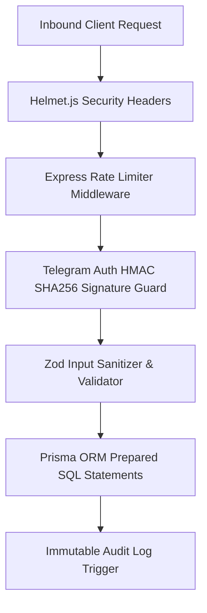

# 11. Xavfsizlik va Himoya Standartlari (Security & Compliance)

## 1. OWASP Top 10 Himoya Strategiyasi

MicroStore loyihasi moliya va qarzlar hisobini yuritganligi sababli, ma'lumotlarning buzilishi, qalbakilashtirilishi va xakerlik hujumlariga qarshi ko meidagicha ko'p bosqichli himoya standartlariga ega.



### OWASP Top 10 Xavfsizlik Javoblari:

| OWASP Xavf Turi | Ta'rifi | MicroStore Himoya Mexanizmi |
|---|---|---|
| **A01: Broken Access Control** | Boshqa do'kon ma'lumotlarini ko'rish | `store_id` bo'yicha Row-Level Tenant Isolation middleware |
| **A02: Cryptographic Failures** | Maxfiy ma'lumotlar oshkor bo'lishi | Barcha ulanishlar HTTPS/TLS 1.3, JWT HS256, Bot Token `.env`da |
| **A03: Injection (SQLi, XSS)** | SQL buyruqlar yoki JS kod tiqish | Prisma ORM parametrli SQL so'rovlari va Zod sanitization |
| **A04: Insecure Design** | Moliya ma'lumotlarini soxtalashtirish | Soft Delete & Immutable Audit Trail (O'chirish taqiqlangan) |
| **A05: Security Misconfiguration** | Ochiq server portlari va xatolar | Vercel Serverless isolated environment + Helmet.js headers |
| **A07: Identification Failures** | Soxta loginlar va token o'g'irlash | Telegram HMAC-SHA256 Auth validation + 24h auth date check |

---

## 2. Input Sanitization va Data Validation (Zod Engine)

Barcha frontend va backend so'rovlariga yuborilayotgan ma'lumotlar strikt Zod skemalari orqali tekshiriladi va zararli harflar/skriptlar qirqib tashlanadi.

```typescript
import { z } from 'zod';

export const supplierTransactionSchema = z.object({
  supplierId: z.string().uuid("Yaroqsiz Ta'minotchi IDsi"),
  type: z.enum(['INCREASE_DEBT', 'DECREASE_DEBT'], {
    errorMap: () => ({ message: "Tranzaksiya turi 'INCREASE_DEBT' yoki 'DECREASE_DEBT' bo'lishi shart" })
  }),
  amount: z
    .number({ invalid_type_error: "Summa raqam bo'lishi kerak" })
    .positive("Summa 0 dan katta bo'lishi shart")
    .max(1000000000, "Summa juda katta (max: 1 milliard)"),
  note: z
    .string()
    .max(255, "Izoh 255 ta belgidan oshmasligi kerak")
    .trim()
    .optional(),
});
```

---

## 3. Production Express Security Setup (Helmet & Rate Limiter)

Quyida backend serverini xavfsizlantiruvchi tayyor middleware kodi keltirilgan:

```typescript
import express from 'express';
import helmet from 'helmet';
import rateLimit from 'express-rate-limit';
import cors from 'cors';

export function setupSecurityMiddleware(app: express.Application) {
  // 1. HTTP Security Headers (Helmet)
  app.use(
    helmet({
      contentSecurityPolicy: {
        directives: {
          defaultSrc: ["'self'"],
          scriptSrc: ["'self'", "'unsafe-inline'", "https://telegram.org"],
          connectSrc: ["'self'", "https://api.telegram.org", "https://*.supabase.co"],
        },
      },
      crossOriginEmbedderPolicy: false,
    })
  );

  // 2. CORS Sozlamalari
  app.use(
    cors({
      origin: process.env.FRONTEND_URL || 'https://microstore.uz',
      methods: ['GET', 'POST', 'PUT', 'DELETE'],
      allowedHeaders: ['Content-Type', 'Authorization', 'X-Client-Tx-ID'],
    })
  );

  // 3. Rate Limiting (DDoS & Brute Force Himoyasi)
  const apiLimiter = rateLimit({
    windowMs: 15 * 60 * 1000, // 15 minut
    max: 200, // Har bir IP dan max 200 ta so'rov
    standardHeaders: true,
    legacyHeaders: false,
    message: {
      success: false,
      error: {
        code: 'TOO_MANY_REQUESTS',
        message: 'Juda ko\'p so\'rov yuborildi. Iltimos 15 daqiqadan keyin qayta urinib ko\'ring.',
      },
    },
  });

  app.use('/api/', apiLimiter);
}
```

---

## 4. Audit Log va Shaffoflik Kafolati (Audit Security)

Bazada moliyaviy ma'lumot saqlanuvchi barcha `daily_revenues` va `supplier_transactions` yozuvlari tahrirlanganda yoki o'chirilganda triggerni ishga tushiradi:
- Eski qiymatlar va yangi qiymatlar `JSONB` shaklida `audit_logs` jadvaliga nusxalanadi.
- Ushbu audit jadvaliga `UPDATE` yoki `DELETE` so'rovlari ma meuriyat darajasida **MUTLAQO TAQIQLANADI** (Append-Only Log Table).

---

## 5. Ochiq Savollar (Open Questions)

1. *Sotuvchilar o'rtasida parollarni ulashib olish holatlarining oldini olish uchun bitta Telegram akkauntdan bir vaqtda kirgan seanslarni cheklash kerakmi?*
2. *PWA LocalStorage-da saqlanadigan Auth JWT tokenini shifrlangan (Encrypted LocalStorage) shaklda saqlash shartmi?*
