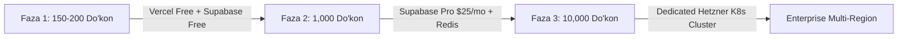

# 12. Unumdorlik va Masshtablanish (Performance & Scale)

## 1. Unumdorlik Metriklari va SLA

MicroStore **"3 soniyali kirish va saqlash"** falsafasini ta'minlash uchun qat'iy Unumdorlik SLA (Service Level Agreement) ko'rsatkichlariga ega:

| Metrika | Nishon Qiymat | O'lchash Manbasi |
|---|---|---|
| **First Contentful Paint (FCP)** | ≤ 0.8 soniya | Google Lighthouse / PWA Load |
| **Time to Interactive (TTI)** | ≤ 1.2 soniya | React CSR Bundle Execution |
| **API Response Time (p95)** | ≤ 120 ms | Vercel Serverless Function Execution |
| **Database Query Latency** | ≤ 15 ms | Supabase PostgreSQL Indexed Queries |
| **PWA Offline Sync Speed** | ≤ 2.0 soniya | Background Sync Queue Execution |

---

## 2. Baza Optimizatsiyasi va Indeksatsiya Strategiyasi

PostgreSQL so'rovlari `O(log N)` tezlikda bajarilishi uchun barcha muhitlarda **Partial Compound Indexes** yo'lga qo'yilgan.

```sql
-- 1. Do'kon bo'yicha aktiv kunlik tushumlarni o'qish tezligi uchun
CREATE INDEX idx_daily_revenues_active 
ON daily_revenues(store_id, entry_date DESC) 
WHERE is_archived = false;

-- 2. Ta'minotchilar ro'yxatini tezkor tartiblash uchun
CREATE INDEX idx_suppliers_active 
ON suppliers(store_id, current_balance DESC) 
WHERE is_archived = false;

-- 3. Idempotent Offline Sync UUID tezkor tekshiruvi uchun
CREATE UNIQUE INDEX idx_daily_revenues_client_tx 
ON daily_revenues(client_tx_id) 
WHERE client_tx_id IS NOT NULL;
```

---

## 3. Frontend Bundle Optimizatsiyasi (React + Vite)

Frontend JS hajmi **< 150 KB (gzipped)** ko'rinishida ushlab turiladi:
1. **Dynamic Import (Code Splitting):** Admin Dashboard paneli alohida lazy-load qilinadi (`React.lazy()`). Sotuvchi 1-Page UI sahifasi darhol yuklanadi.
2. **Tree Shaking & Tailwind Purge:** Ishlatilmagan CSS va JS kutubxonalar build jarayonida to'liq tozalab tashlanadi.

```tsx
import React, { Suspense, lazy } from 'react';

// Admin Dashboard-ni faqat so'ralganda yuklash (Code Splitting)
const DashboardPage = lazy(() => import('./pages/DashboardPage'));

export const AppRouter: React.FC = () => {
  return (
    <Suspense fallback={<div className="p-4 text-center">Yuklanmoqda...</div>}>
      <Routes>
        <Route path="/" element={<SellerPage />} />
        <Route path="/admin" element={<DashboardPage />} />
      </Routes>
    </Suspense>
  );
};
```

---

## 4. Masshtablanish Strategiyasi (Scaling Roadmap)



- **Faza 1 (150 - 200 Do'kon):** Vercel Serverless + Supabase Free Tier ($0/oy).
- **Faza 2 (1,000 Do'kon):** Supabase Pro ($25/oy — DB size 8GB, Connection limit 500). Upstash Redis Caching qo'shiladi.
- **Faza 3 (10,000+ Do'kon):** Dedicated VPS / Hetzner Cloud (Docker Compose / Kubernetes Cluster, Read Replicas).

---

## 5. Ochiq Savollar (Open Questions)

1. *Admin dashboard grafiklarini har safar bazadan hisoblamaslik uchun `daily_revenue_summaries` nomli qarama-qarshi materializatsiyalashgan (Materialized View) jadval yuritish kerakmi?*
2. *Service Worker cache hajmi 5MB dan oshganda eski assetlarni tozalash politikasi (TTL 30 kun) yetarlimi?*
