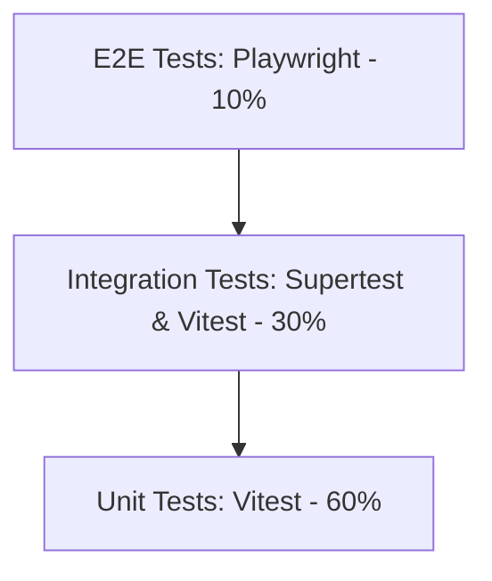

# 14. Sinov Strategiyasi (Testing Strategy & QA)

## 1. Test Piramidasi va Avtomatlashtirish

MicroStore loyihasi 4-5 kunlik qisqa vaqt ichida barpo etilayotgani sababli, test arxitekturasi **yuqori unumli va tezkor sifat nazoratiga** (Fast Feedback Loop) qaratilgan.



- **Unit Tests (60%):** Zod validation skemalari, valyuta formatlash, JAMI summani avto-hisoblash mantiqlari.
- **Integration Tests (30%):** Express API route handlerlar, Prisma DB querylari, Telegram auth signature check.
- **E2E Tests (10%):** Playwright orqali 1-Page UI sotuvchisi tushum kiritishi va submit tugmasini bosishi ssenariysi.

---

## 2. Unit & Integration Testing (Vitest & Supertest)

Vitest tezkor va Vite bilan 100% integratsiyalashgani sababli asosiy test runner sifatida tanlandi.

### Production Vitest Test Kodu (`revenue.test.ts`):

```typescript
import { describe, it, expect, beforeEach, vi } from 'vitest';
import { calculateTotalRevenue } from '../src/utils/calculator';
import { verifyTelegramAuth } from '../src/utils/telegramAuth';

describe('Calculator & Auth Unit Tests', () => {
  it('JAMI summani to\'g\'ri hisoblashi kerak (Naqd + Terminal + Xolis)', () => {
    const cash = 100000;
    const terminal = 50000;
    const xolis = 10000;

    const total = calculateTotalRevenue(cash, terminal, xolis);
    expect(total).toBe(160000);
  });

  it('Manfiy summalarda xatolik berishi kerak', () => {
    expect(() => calculateTotalRevenue(-50, 100, 0)).toThrow('Summa manfiy bo\'lishi mumkin emas');
  });

  it('Soxta Telegram Auth Hash rad etilishi kerak', () => {
    const fakeAuthData = {
      id: 12345,
      first_name: 'Hacker',
      auth_date: Math.floor(Date.now() / 1000),
      hash: 'invalid_fake_hash_123'
    };

    const isValid = verifyTelegramAuth(fakeAuthData, 'dummy_bot_token');
    expect(isValid).toBe(false);
  });
});
```

---

## 3. E2E Browser Testing (Playwright PWA Test)

```typescript
import { test, expect } from '@playwright/test';

test.describe('1-Page Sotuvchi UI Flow', () => {
  test('Sotuvchi tushum kiritib Submit bosishi kerak', async ({ page }) => {
    await page.goto('http://localhost:3000');

    // 1. Inputs topish va to'ldirish
    await page.fill('input[placeholder="0"] >> nth=0', '150000'); // Naqd
    await page.fill('input[placeholder="0"] >> nth=1', '80000');  // Terminal

    // 2. Auto Total hisobini tekshirish
    const totalText = await page.textContent('.text-emerald-400');
    expect(totalText).toContain('230,000 UZS');

    // 3. Submit tugmasini bosish
    await page.click('button[type="submit"]');

    // 4. Alert / Success state tekshiruvi
    const successToast = page.locator('text=✅ Tushum muvaffaqiyatli saqlandi');
    await expect(successToast).toBeVisible();
  });
});
```

---

## 4. Ochiq Savollar (Open Questions)

1. *GitHub Actions CI/CD pipeline ichida har bir Pull Request-da Playwright E2E testlarini avtomatik yurgazish pipeline vaqtini uzaytirib yubormaydimi?*
2. *Supabase Test Database o'rniga in-memory SQLite bazasidan integration testlarda foydalanish ma'qulmi?*
