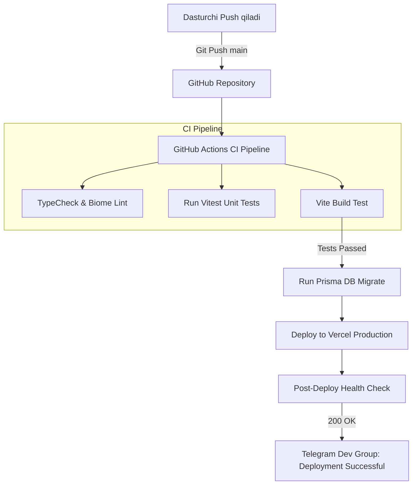

# 15. DevOps va Deploy Jarayoni (DevOps & Deployment Pipeline)

## 1. CI/CD Avtomatlashtirish Pipeline Diagrammasi

MicroStore har bir kod o'zgarishi (Git Commit) avtomatik ravishda sinovdan o'tishi va Vercel platformasiga **Zero-Downtime Deployment** rejimi bilan joylashtirilishi uchun GitHub Actions bilan integratsiya qilingan.



---

## 2. GitHub Actions Workflow Kodu (`.github/workflows/deploy.yml`)

```yaml
name: MicroStore CI/CD Deployment Pipeline

on:
  push:
    branches: [ main ]
  pull_request:
    branches: [ main ]

jobs:
  test-and-build:
    runs-on: ubuntu-latest

    steps:
      - name: 1. Repozitoriyani yuklash
        uses: actions/checkout@v4

      - name: 2. Node.js sozlash
        uses: actions/setup-node@v4
        with:
          node-version: 20
          cache: 'npm'

      - name: 3. Bog'liqliklarni o'rnatish
        run: npm ci

      - name: 4. TypeScript TypeCheck
        run: npm run typecheck

      - name: 5. Vitest Unit Testlarini yurgazish
        run: npm test

      - name: 6. Vite Build tekshiruvi
        run: npm run build

  deploy-production:
    needs: test-and-build
    if: github.ref == 'refs/heads/main'
    runs-on: ubuntu-latest

    steps:
      - name: 1. Repozitoriyani yuklash
        uses: actions/checkout@v4

      - name: 2. Prisma Migration deploy
        env:
          DATABASE_URL: ${{ secrets.PRODUCTION_DATABASE_URL }}
        run: npx prisma migrate deploy

      - name: 3. Vercel Production Deployment
        uses: amondnet/vercel-action@v25
        with:
          vercel-token: ${{ secrets.VERCEL_TOKEN }}
          vercel-org-id: ${{ secrets.VERCEL_ORG_ID }}
          vercel-project-id: ${{ secrets.VERCEL_PROJECT_ID }}
          vercel-args: '--prod'

      - name: 4. Telegram Notification yuborish
        uses: appleboy/telegram-action@master
        with:
          to: ${{ secrets.TELEGRAM_DEV_CHAT_ID }}
          token: ${{ secrets.TELEGRAM_BOT_TOKEN }}
          message: |
            🚀 **MicroStore Yangi Versiyasi Ishga Tushdi!**
            Commit: ${{ github.sha }}
            Deploy Status: SUCCESS ✅
```

---

## 3. Database Migration va Rollback Rejasi

### Migration Strategy:
1. `npx prisma migrate dev --name <migration_name>` mahalliy muhitda ishlatiladi va SQL migratsiya fayllari Git repozitoriyasiga topshiriladi.
2. Production muhitiga faqat `npx prisma migrate deploy` (destruktiz bo'lmagan xavfsiz so'rovlar) ishlatiladi.

### Rollback (Orqaga qaytarish) Plan:
- **Frontend/Backend:** Vercel Dashboard orqali 1-click **Instant Rollback** tugmasini bosib 5 soniya ichida avvalgi ishchi build-ga qaytiladi.
- **Database:** Prisma schema orqali `down.sql` zaxira skriptlari zudlik bilan ishga tushiriladi.

---

## 4. Ochiq Savollar (Open Questions)

1. *Production muhitiga o'tishdan oldin Staging URL (masalan: `staging.microstore.uz`) muhitini yaratish zarurmi?*
2. *Vercel deployment tokenining amal qilish muddatini har 90 kunda yangilab turish talabi bor-yo'qligi?*
