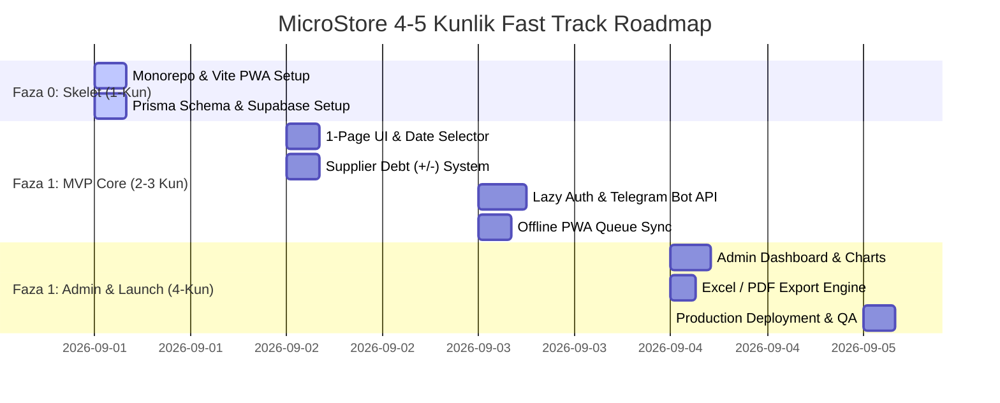

# 16. Yo'l Xaritasi va Bosqichlar (Roadmap & Phases)

## 1. Umumiy Yo me Xaritasi va Bajarish Grafigi

MicroStore loyihasi belgilangan **4-5 kunlik qisqa deadline** ichida ishlab chiqarishga (Production) topshirilishi uchun 4 ta aniq bosqichga (Faza 0 -> Faza 3) bo'lingan.

---

## 2. Granulyar Vazifalar Ro'yxati (1-4 Soatlik Bo'laklar)

### Faza 0: Skelet va Infratuzilma (Kun 1 — 8 soat)
- [x] **Task 0.1 (2 soat):** npm workspaces bilan monorepo yaratish (`apps/web`, `apps/api`, `packages/database`).
- [x] **Task 0.2 (2 soat):** React 18 + Vite + Tailwind CSS va PWA Service Worker konfiguratsiyasi.
- [x] **Task 0.3 (2 soat):** Supabase PostgreSQL bazasini ulash va Prisma schema migratsiyasini ishga tushirish.
- [x] **Task 0.4 (2 soat):** Express API boilerplate va Vercel serverless sozlamalarini bajarish.

### Faza 1: MVP Yadro Funksionalligi (Kun 2 va 3 — 18 soat)
- [ ] **Task 1.1 (3 soat):** `DateSelector` va `RevenueInputs` (Naqd, Terminal, Xolis) reaktiv komponentlarini qurish.
- [ ] **Task 1.2 (2 soat):** `JAMI TUSHUM` auto-calculate va dynamic state logic-ni integratsiya qilish.
- [ ] **Task 1.3 (4 soat):** Ta'minotchilar ro'yxati va `+` (qarz oshirish) / `-` (pul berildi) modal interfeysi.
- [ ] **Task 1.4 (4 soat):** Lazy Auth: Submit bosilganda Telegram Widget Auth API-ni ulash.
- [ ] **Task 1.5 (5 soat):** Offline LocalStorage queue va idempotent `X-Client-Tx-ID` sync logikasini yozish.

### Faza 1 Yakuni: Admin Dashboard & Launch (Kun 4 — 12 soat)
- [ ] **Task 2.1 (4 soat):** Admin Analitika paneli (KPI kartochkalar + Chart.js sotuvlar grafigi).
- [ ] **Task 2.2 (3 soat):** `exceljs` bilan Excel va PDF export servislarini backend'da tayyorlash.
- [ ] **Task 2.3 (3 soat):** Telegram Bot eslatmalar webhook funksiyalarini ulash.
- [ ] **Task 2.4 (2 soat):** E2E testing, Vercel Production deployment va Keep-Alive Cron Ping sozlash.

---

## 3. Fazalardan O'tish Mezonlari (Phase Exit Criteria)

1. **Faza 0 Exit Criteria:** Monorepo o'rnatilgan, PWA sahifasi ochiladi, Prisma Supabase bazasiga ulanib `SELECT 1` javobini oladi.
2. **Faza 1 Exit Criteria:** Sotuvchi internet uzilgan rejimda va yongan rejimda 3 soniya ichida tushum kiritib, ta'minotchi balansini o'zgartira oladi.
3. **Production Launch Criteria:** Admin paneldan Excel yuklab olinadi, Playwright E2E testlari 100% o'tgan va Vercel build status `READY`.

---

## 4. Ochiq Savollar (Open Questions)

1. *Dastlabki pilot sinovni 3 ta haqiqiy do'kon sotuvchisida 4-kuni o'tkazish uchun do'konlar tanlandimi?*
2. *Faza 2 dagi ovozli kiritish (Voice Input) funksiyasini 1-oyning oxiriga mo meallash ma'qulmi?*
