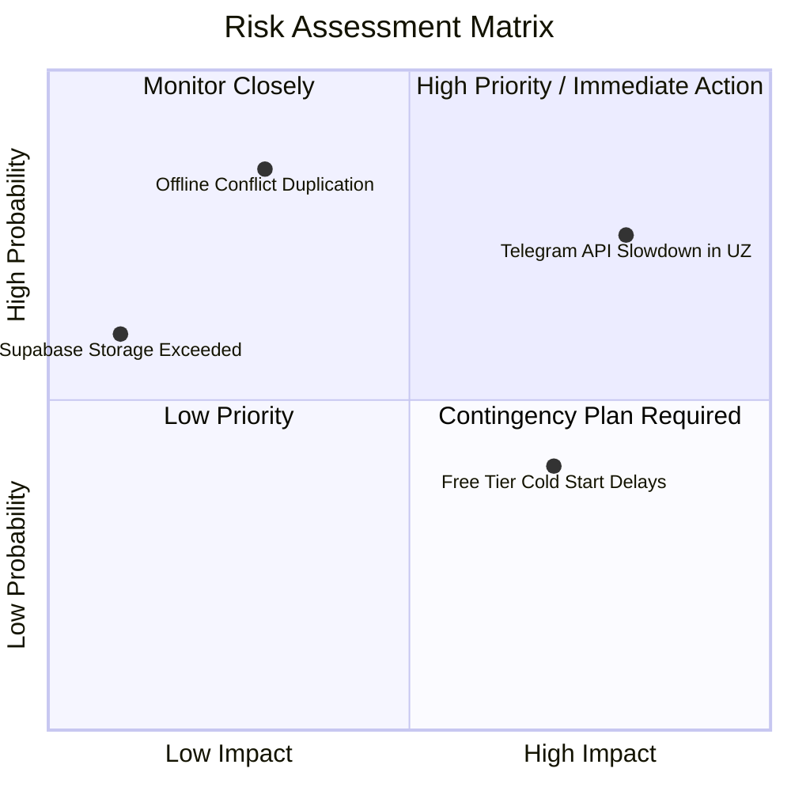

# 17. Risklar va Murosalar (Risks & Tradeoffs)

## 1. Risklar Matritsasi (Risk Assessment Matrix)

MicroStore loyihasida yuzaga kelishi mumkin bo'lgan texnik va biznes risklari, ularning ehtimolligi (`Likelihood`) va ta'siri (`Impact`) tahlil qilindi.

---

## 2. Top Risklar va Boshqaruv Rejasi (Mitigation Actions)

| Risk Turi | Ehtimollik × Ta'sir | Erta Ogohlantirish Belgisi | Oldini Olish Chorasi (Prevention) | Yuz Bersa Nima Qilish (Contingency) |
|---|---|---|---|---|
| **1. Telegram API Sekinlashishi / Bloklanishi** | **Yuqori × Yuqori** | Login bo'lish va webhooklar 5s+ kutdirib qolishi | Asinxron Telegram integration, PWA Local Auth zaxirasi | PWA ichida 4-xonali PIN-kod bilan 1-click local login yoqiladi |
| **2. Offline Data Sync Duplikasiyasi** | O'rta × Yuqori | Bir kunda bitta tushum 2 marta yozilib qolishi | Client-side `UUID` (Idempotent API Header) | Backend DB unique constraint `client_tx_id` bo'yicha e'tiborsiz qoldiradi |
| **3. Serverless Cold Start Sekinlashuvi** | Yuqori × O'rta | 1-page UI ochilishida 3s+ sekinlik | Keep-Alive Cron Ping (har 10 minutda) | Edge Serverless Caching va PWA Static Assets cache |
| **4. Sotuvchining Noto'g'ri Summa Kiritishi** | O'rta × O'rta | Sotuvchi 10,000 o'rniga 100,000 kiritsa | Real-time input formatter va tasdiqlash modali | Immutable Audit Trail orqali Admin tahrirlaydi |

---

## 3. Texnik Qarzlar va Murosalar (Tradeoff Log)

1. **Tradeoff: LocalStorage vs IndexedDB:**
   - *Qaror:* 4-5 kunlik deadline uchun sodda `LocalStorage` tanlandi.
   - *Oqibat:* LocalStorage 5MB chekloviga ega. 2.0-versiyada `IndexedDB` (Dexie.js) ga ko'chiriladi.
2. **Tradeoff: Monolith DB vs Separated Databases:**
   - *Qaror:* Barcha do'konlar 1 ta PostgreSQL bazasida `store_id` bilan ajratildi.
   - *Oqibat:* Database backup har bir do'kon uchun alohida emas, umumiy olinadi.

---

## 4. Ochiq Savollar (Open Questions)

1. *Agar sotuvchi adashib 1 million so'm o'rniga 1 milliard so'm kiritsa, input maydonida "Katta summa kiritildi, tasdiqlaysizmi?" degan qo meimcha alert chiqarilishi kerakmi?*
2. *PWA LocalStorage to'lib qolgan holatda eskirgan keshlarni avtomatik tozalash funksiyasi yetarlimi?*
