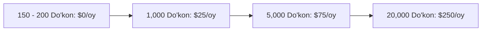

# 18. Xarajatlar Smeta va Prognozi (Cost Estimate & Scaling Budget)

## 1. Boshlang'ich Infratuzilma Smeta (Faza 1 — 150-200 Do'kon)

MicroStore loyihasi **$0 operatsion oylik xarajat** bilan ishga tushadi:

| Komponent | Provayder | Bepul Limit (Free Tier) | MicroStore Ishlatish | Oylik Narx |
|---|---|---|---|---|
| **Frontend CDN & PWA** | Vercel Starter | 100 GB Bandwidth/oy | ~10 GB | **$0.00** |
| **Backend Serverless API** | Vercel Serverless | 100,000 requests/kun | ~3,000 req/kun | **$0.00** |
| **PostgreSQL Database** | Supabase Cloud | 500 MB Storage, 50k MAU | ~120 MB / yil | **$0.00** |
| **Telegram Bot API** | Telegram Cloud | Cheksiz Bot Webhook API | ~1,000 req/kun | **$0.00** |
| **Domain Name (Sotiq)** | Uz domain | uz registrar | 1 yil uchun | **~$8.00 / yil** |
| **JAMI OYLIK XARAJAТ** | - | - | - | **$0.00 / oy** |

---

## 2. Masshtablanish Xarajatlar Prognozi (Cost Scaling Roadmap)

### 1,000 Do'kon Bosqichida (6 - 12-oy):
- **Supabase Pro Database:** $25 / oy (8 GB Database space, Auto-backups).
- **Vercel Pro Team:** $20 / oy (Oshirilgan bandwidth va execution limits).
- **Jami:** **~$45 / oy**.

---

## 3. Ochiq Savollar (Open Questions)

1. *Agar SaaS obuna to'lovi har bir do'kondan oyiga 50,000 so'm ($4) qilinsa, 200 ta do'kondan tushadigan $800 oylik daromad infratuzilma xarajatlarini 100% qoplaydimi?*
2. *.uz domen narxini va mahalliy to'lov tizimlari (Click/Payme) komissiyasini hisobga olish kerakmi?*
