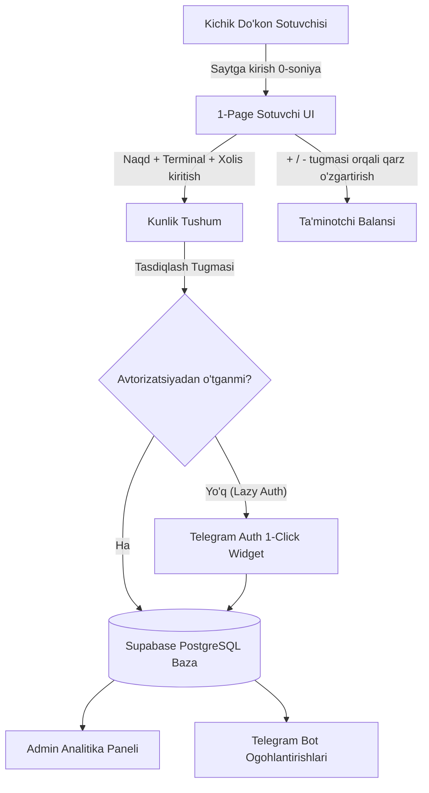
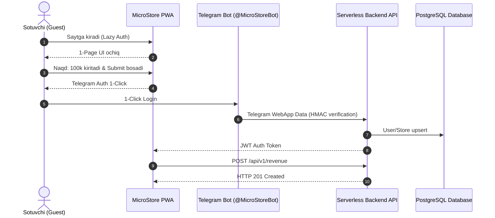
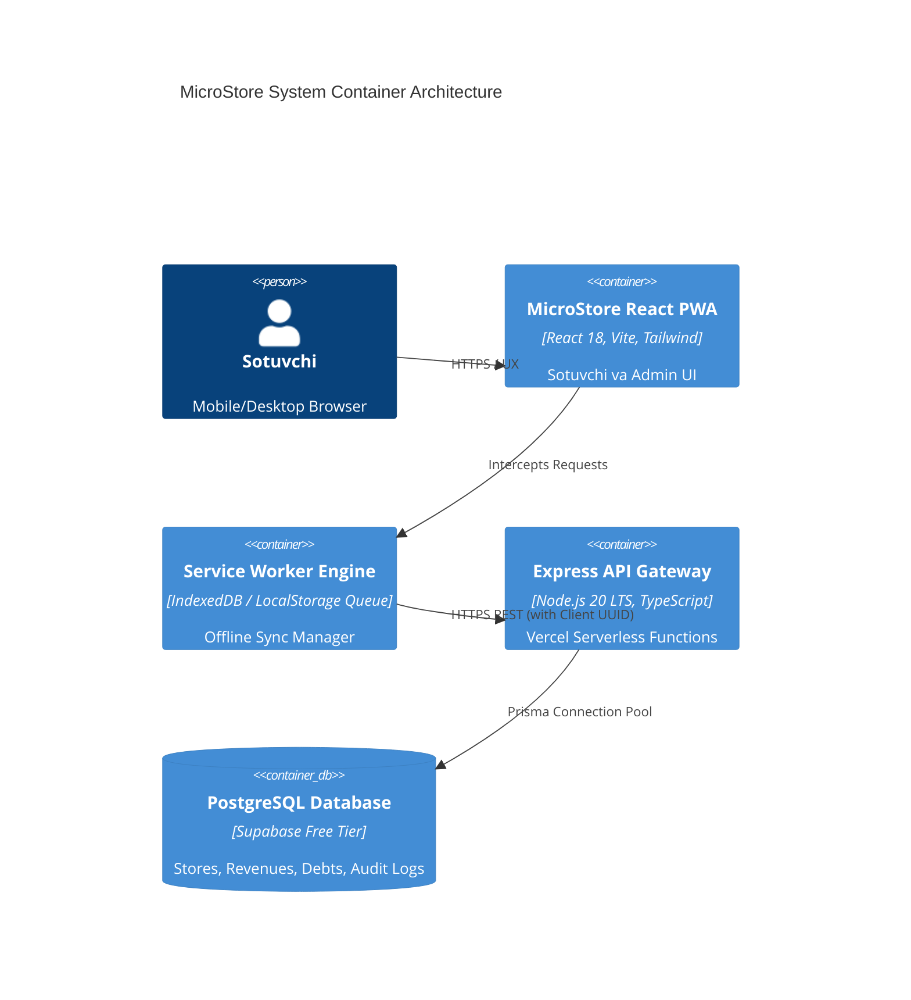

# 📱 MicroStore — To'liq Arxitektura Hujjati (Master Architecture Specification)

> **Loyiha Nomi:** MicroStore (Mahalliy Sotuvchilar uchun Kundalik Tushum va Qarzlar Hisobi)  
> **Muallif:** Lead Solution Architect & Technical Director  
> **Versiya:** 1.0.0 Production Specification  
> **Sana:** 2026-08-29  

---

## 📚 Hujjat Mundarijasi (Table of Contents)

1. [00. Ijroiya Xulosasi (Executive Summary)](#00-ijroiya-xulosasi-executive-summary)
2. [01. Muammo va Maqsadlar (Problem & Goals)](#01-muammo-va-maqsadlar-problem--goals)
3. [02. Foydalanuvchilar va Rollar (Users & Roles)](#02-foydalanuvchilar-va-rollar-users--roles)
4. [03. Qamrov va Funksiyalar Spetsifikatsiyasi (Scope & Features)](#03-qamrov-va-funksiyalar-spetsifikatsiyasi-scope--features)
5. [04. Tizim Arxitekturasi (System Architecture)](#04-tizim-arxitekturasi-system-architecture)
6. [05. Ma'lumotlar Modeli (Data Model & Schema)](#05-malumotlar-modeli-data-model--database-schema)
7. [06. API Dizayni va Standartlari (API Design & Specifications)](#06-api-dizayni-va-standartlari-api-design--specifications)
8. [07. Integratsiyalar (External System Integrations)](#07-integratsiyalar-external-system-integrations)
9. [08. Autentifikatsiya va Ruxsatlar (Auth & Permissions)](#08-autentifikatsiya-va-ruxsatlar-auth--permissions)
10. [09. Frontend Arxitekturasi va UI/UX (Frontend Architecture)](#09-frontend-arxitekturasi-va-uiux-frontend-architecture)
11. [10. Infratuzilma va Xosting Topologiyasi (Infrastructure Topology)](#10-infratuzilma-va-xosting-topologiyasi-infrastructure-topology)
12. [11. Xavfsizlik va Himoya Standartlari (Security & Compliance)](#11-xavfsizlik-va-himoya-standartlari-security--compliance)
13. [12. Unumdorlik va Masshtablanish (Performance & Scale)](#12-unumdorlik-va-masshtablanish-performance--scale)
14. [13. Kuzatuvchanlik va Metrikalar (Observability & Monitoring)](#13-kuzatuvchanlik-va-metrikalar-observability--monitoring)
15. [14. Sinov Strategiyasi (Testing Strategy & QA)](#14-sinov-strategiyasi-testing-strategy--qa)
16. [15. DevOps va Deploy Jarayoni (DevOps & Deployment Pipeline)](#15-devops-va-deploy-jarayoni-devops--deployment-pipeline)
17. [16. Yo'l Xaritasi va Bosqichlar (Roadmap & Phases)](#16-yol-xaritasi-va-bosqichlar-roadmap--phases)
18. [17. Risklar va Murosalar (Risks & Tradeoffs)](#17-risklar-va-murosalar-risks--tradeoffs)
19. [18. Xarajatlar Smeta va Prognozi (Cost Estimate & Scaling Budget)](#18-xarajatlar-smeta-va-prognozi-cost-estimate--scaling-budget)
20. [19. Arxitektura Qarorlari Jurnali (Architecture Decision Log - ADR)](#19-arxitektura-qarorlari-jurnali-architecture-decision-log---adr)
21. [20. Atamalar Izohli Lug'ati (Glossary)](#20-atamalar-izohli-lugati-glossary)

---

# 00. Ijroiya Xulosasi (Executive Summary)

**MicroStore** — kichik do'konlar, rastalar va mahalliy sotuvchilar uchun mo'ljallangan, kunlik tushum (Naqd, Terminal, Xolis) hamda ta'minotchilar oldidagi qarzdorlik balansini soniyalar ichida yurituvchi ultra-sodda 1-sahifali Progressive Web Application (PWA) va Admin Analitika Paneli.

An'anaviy POS va ERP tizimlari murakkab tovarlar katalogi (SKU), shtrix-kod skanerlash va apparat integratsiyalarini talab qiladi. MicroStore ushbu muammoni **"0 soniya tayyorgarlik"** va **3 soniyalik kiritish interfeysi** orqali to'liq raqamlashtiradi.

### Key Target Metrics:
- **Faol Do'konlar:** 150 - 200 ta (MAU)
- **Kunlik Tranzaksiyalar:** 600 - 1,000 req/kun
- **Uptime SLA:** 99.9%
- **Infratuzilma Xarajati:** **$0 / oy** (Vercel Free + Supabase Free)
- **Timeline:** 4 - 5 kun (Fast Track Release)

---

# 01. Muammo va Maqsadlar (Problem & Goals)

O'zbekistondagi kichik do'konlarning 80% dan ortig'i Hisob-kitobni qog'oz daftarda olib boradi. Daftarlar yo'qoladi, yozuvlar o'chib ketadi va sotuvchi hamda do'kon egasi o'rtasida shubhalar tug meiladi.

### Core Value Proposition:
Sotuvchi ilovani ochganidan so'ng 3 soniya ichida bugungi Naqd, Terminal va Xolis tushumini kiritib, bitta bosish bilan ta'minotchi qarzini oshirishi yoki kamaytira olishi.

### Non-Goals (Out of Scope):
- ❌ SKU / Ombor Inventarizatsiyasi
- ❌ Apparat (Printer / Skaner) Integratsiyalari
- ❌ Xaridorlar Nasiya hisobi
- ❌ Pullik SMS OTP Login

---

# 02. Foydalanuvchilar va Rollar (Users & Roles)

Tizimda 2 ta sub'ekt mavjud: **Store User** (Do'kon egasi va sotuvchining yagona do'kon seansi) hamda **Platform Super-Admin**.

---

# 03. Qamrov va Funksiyalar Spetsifikatsiyasi (Scope & Features)

- **A-Blok (1-Page UI):** Sticky Date Selector, Naqd / Terminal / Xolis Inputs, Auto Total Calculation, Supplier debt `+` (qarz oshdi) va `-` (pul berildi) buttons.
- **B-Blok (Admin Dashboard):** KPI Cards (Bugungi Naqd vs Terminal, Oylik Daromad), Sotuvlar Grafigi (Stacked Bar Chart), Ta'minotchilar Analizatori, Excel XLSX & PDF Export Engine.

---

# 04. Tizim Arxitekturasi (System Architecture)

MicroStore client-side React PWA, Vercel Serverless Express API Gateway va Supabase Cloud PostgreSQL bazasidan iborat.

---

# 05. Ma'lumotlar Modeli (Data Model & Schema)

### Key Prisma Schema Overview:
- `Store`: Do'konlar (id, name, phone, isActive)
- `User`: Telegram foydalanuvchilari (id, storeId, telegramId)
- `DailyRevenue`: Kunlik tushumlar (id, storeId, entryDate, cashAmount, terminalAmount, xolisAmount, totalAmount, clientTxId, isArchived)
- `Supplier`: Ta'minotchilar (id, storeId, name, currentBalance, isArchived)
- `SupplierTransaction`: Qarz o'zgarishlari (id, supplierId, type [INCREASE_DEBT/DECREASE_DEBT], amount, note, clientTxId)
- `AuditLog`: O'zgarishlar tarixi (id, storeId, userId, entityName, entityId, action, oldValues, newValues)

---

# 06. API Dizayni va Standartlari (API Design)

- `POST /api/v1/auth/telegram` — Telegram Auth HMAC validation
- `GET /api/v1/revenues` — Kunlik tushumlar ro'yxati
- `POST /api/v1/revenues` — Kunlik tushumni upsert qilish (`X-Client-Tx-ID` header bilan)
- `GET /api/v1/suppliers` — Ta'minotchilar va balance ro'yxati
- `POST /api/v1/suppliers/:id/transaction` — Ta'minotchi qarzini `+` yoki `-` qilish

---

# 07. Integratsiyalar (External Systems)

- **Telegram Bot API (`grammy`):** Webhook handler, WebApp 1-Click Auth, Daily Reminder Cron (kechki soat 20:00 da tushum eslatmasi).
- **Excel Export Engine (`exceljs`):** XLSX hisobot shakllantirish.
- **PDF Akt-Sverka Engine (`pdfmake`):** Rasmiy chop etishga tayyor PDF ta'minotchi qarzi akt-sverka hujjati.

---

# 08. Autentifikatsiya va Ruxsatlar (Auth & Permissions)

- Telegram Auth HMAC-SHA256 signature verification.
- 90-kunlik JWT Auth Token (`HS256`).
- Row-Level Tenant Isolation middleware (`req.storeId` bo'yicha strikt `WHERE store_id = req.storeId` injection).

---

# 09. Frontend Arxitekturasi (Frontend Architecture)

- React 18, TypeScript, Vite, Tailwind CSS, Zustand state management.
- Service Worker + LocalStorage Offline Sync Queue.
- Responsive Mobile-First Design (Android/iOS PWA Add to Home Screen).

---

# 10. Infratuzilma va Xosting (Infrastructure)

- **Frontend:** Vercel Global Edge CDN ($0/oy)
- **Backend:** Vercel Serverless Functions ($0/oy)
- **Database:** Supabase PostgreSQL Free Tier ($0/oy)
- **Keep-Alive Cron Ping:** Har 10 minutda `/api/v1/health/ping` chaqiruvi (Cold-start himoyasi).

---

# 11. Xavfsizlik va Himoya (Security & Compliance)

- OWASP Top 10 mitigations.
- Zod Schema Input Sanitization.
- Helmet.js Security Headers & Express Rate Limiter.
- Immutable Audit Trail (Bazadan hard delete mutlaqo taqiqlangan).

---

# 12. Unumdorlik va Masshtablanish (Performance & Scale)

- Partial Compound PostgreSQL Indexes (`idx_daily_revenues_active`, `idx_suppliers_active`).
- React Code Splitting (`React.lazy()` admin dashboard uchun).
- SLA: FCP ≤ 0.8s, TTI ≤ 1.2s, API Response p95 ≤ 120ms.

---

# 13. Kuzatuvchanlik (Observability & Alarms)

- Structured JSON Logging.
- Sentry.io Error Tracking.
- Telegram Developer Group-ga zudlik bilan 500 error kritikal alarmlar yuborish.

---

# 14. Sinov Strategiyasi (Testing Strategy)

- Vitest Unit Testing (Zod, Auth, Calculator).
- Supertest Integration API tests.
- Playwright E2E PWA UI Tests.

---

# 15. DevOps va Deploy Jarayoni (DevOps & Deploy)

- GitHub Actions CI/CD Pipeline.
- Automatic Prisma DB Migration (`prisma migrate deploy`).
- Vercel Instant 1-Click Rollback.

---

# 16. Yo'l Xaritasi (Roadmap & Fast Track)

- **Faza 0 (Kun 1):** Monorepo, Vite PWA, Supabase Prisma Setup.
- **Faza 1 (Kun 2-3):** 1-Page UI, Supplier Debt (+/-), Lazy Telegram Auth, Offline Sync.
- **Faza 1 Launch (Kun 4):** Admin Dashboard, Excel Export, Vercel Production Deploy.

---

# 17. Risklar va Murosalar (Risks & Tradeoffs)

- Telegram API slowdown -> Local PIN Auth Fallback.
- Offline duplication -> Client-Side UUID idempotency header.
- Cold start -> 10m Keep-Alive Cron Ping.

---

# 18. Xarajatlar Smeta (Cost Estimate)

- **Faza 1 (200 Do'kon):** **$0.00 / oy**
- **Faza 2 (1,000 Do'kon):** **~$45.00 / oy** (Supabase Pro + Vercel Pro)

---

# 19. Qarorlar Jurnali (ADR Log)

- **ADR-001:** SMS OTP o'rniga Telegram Auth (0$ cost).
- **ADR-002:** Hard delete o'rniga Soft delete va Audit Trail.
- **ADR-003:** Client UUID Idempotent Sync.
- **ADR-004:** VPS o'rniga Vercel + Supabase Serverless.

---

# 20. Atamalar Lug'ati (Glossary)

PWA, Lazy Auth, Audit Trail, Soft Delete, Idempotency, MAU, SKU, HMAC-SHA256, Tenant Isolation, Cold Start.
